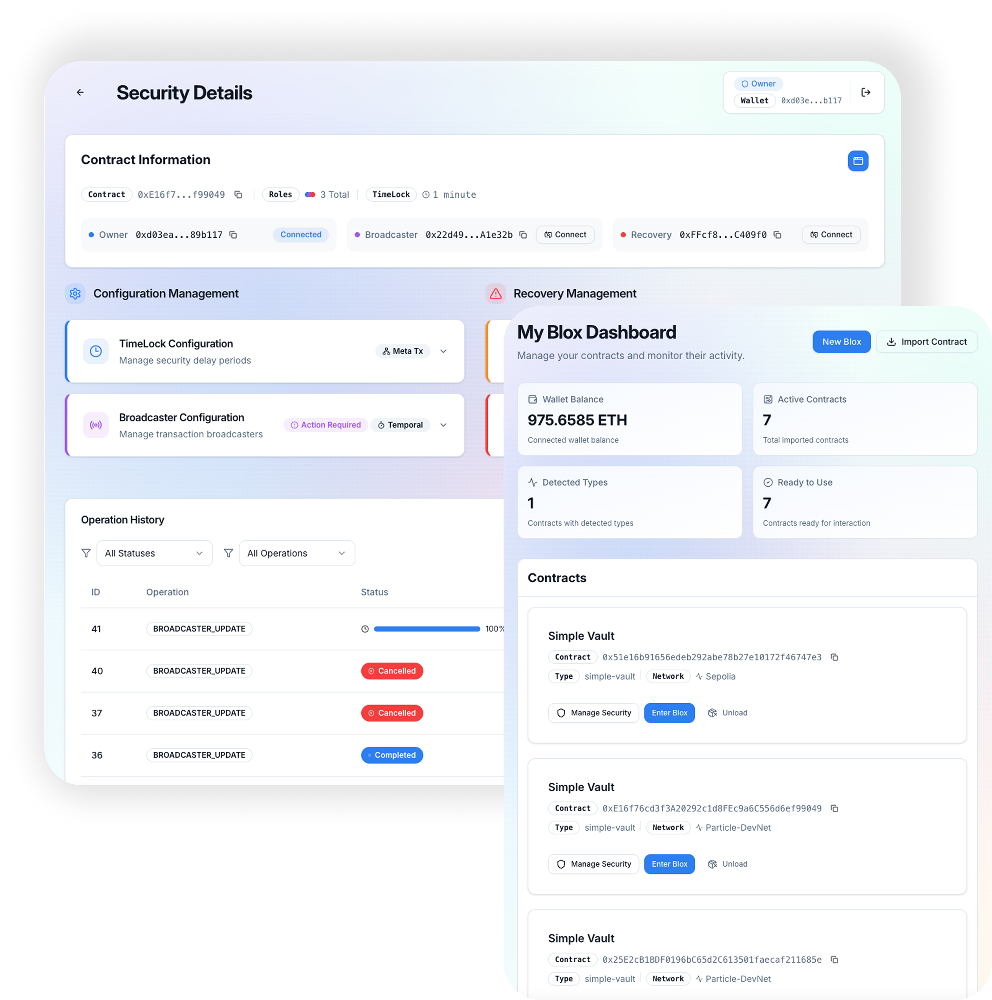
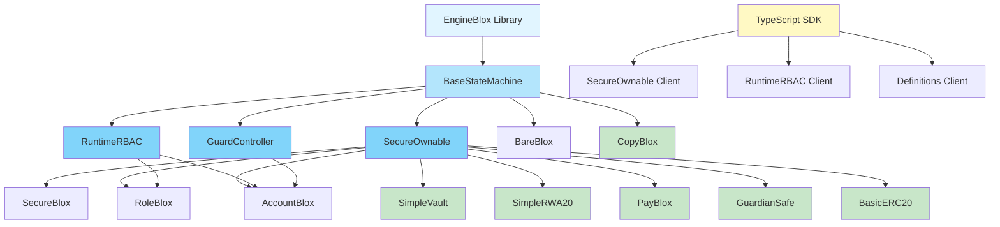

# Bloxchain Protocol: Enterprise-Grade Blockchain Security Framework

[](https://opensource.org/licenses/MPL-2.0)
[](https://soliditylang.org/)
[](./sdk/typescript/)
[](https://hardhat.org/)
[](https://sepolia.etherscan.io/)
[](https://particlecs.com/)

> **⚠️ EXPERIMENTAL SOFTWARE WARNING**  
> This repository contains experimental smart contract code. While the framework is feature-complete and tested, it is not yet audited for production use. Use at your own risk and do not deploy with real assets without proper security review.

## 🚀 What is Bloxchain Protocol?

Bloxchain Protocol is a **revolutionary blockchain security architecture** that eliminates single-point failures through **mandatory multi-signature workflows** and **atomic transaction breakdown**. Unlike traditional smart contracts that execute immediately, Bloxchain implements **time-locked operations** and **meta-transactions** with **role separation** to provide enterprise-grade security.

### 🎯 Core Innovation: EngineBlox Multi-Phase Workflows

**EngineBlox** is the core library that powers Bloxchain Protocol's enterprise-grade security architecture. It breaks traditional atomic blockchain transactions into **multi-phase workflows** where:

- **Smart contracts control storage access** (not individual wallets)
- **Every transaction requires minimum 2 signatures** (optional: multi-role setup)
- **Time-locked operations** provide intervention windows
- **Meta-transactions** enable gasless, delegated execution
- **Dynamic role-based access control** adapts without code changes
- **Modular composition** enables building enterprise applications through component assembly


*[SandBlox](https://sandblox.app/) Transactions - Main interface showing contract operations*

## 🏗️ Architecture Overview

### Core Components



### 🏗️ Modular Composition Architecture

Bloxchain Protocol uses a **modular composition pattern** where components can be combined to build enterprise-grade applications:

- **BaseStateMachine**: Foundation for all blox contracts
- **SecureOwnable**: Multi-role security (Owner, Broadcaster, Recovery)
- **RuntimeRBAC**: Dynamic role-based access control
- **GuardController**: Controlled endpoint for external contract interactions with dynamic access and workflow definition
- **HookManager**: External hook contract attachment (experimental)

**Template Contracts** (in `contracts/examples/templates/`):
- **BareBlox**: Minimal BaseStateMachine only
- **SecureBlox**: Basic SecureOwnable functionality
- **RoleBlox**: SecureOwnable + RuntimeRBAC
- **AccountBlox**: GuardController + RuntimeRBAC + SecureOwnable
- **MachineBlox**: GuardController + RuntimeRBAC + SecureOwnable + HookManager (experimental)

### 📦 Example Applications

The `contracts/examples/` directory contains real-world applications demonstrating Bloxchain Protocol capabilities:

| Application | Use Case | Key Features |
|-------------|----------|-------------|
| **SimpleVault** | Secure asset management | Time-locked ETH/ERC20 withdrawals with multi-signature approval |
| **SimpleRWA20** | Tokenized real-world assets | Secure token minting/burning with meta-transaction support |
| **PayBlox** | Payment management system | Payment tracking, accounting, and execution with time-delay workflows |
| **CopyBlox** | Blox cloning factory | EIP-1167 minimal proxy pattern for deploying multiple blox instances |
| **GuardianSafe** | Safe wallet integration | Safe wallet wrapper with Bloxchain security workflows |
| **BasicERC20** | Basic token example | Standard ERC20 token implementation using Bloxchain security |

### 🛡️ Security Model

**Mandatory Multi-Signature Architecture:**
- **Time-Delay Workflow**: Request → Wait → Approve (2 signatures)
- **Meta-Transaction Workflow**: Sign → Execute (2 signatures, role separation)
- **No Single-Point Failures**: Contract controls storage, not wallets
- **Temporal Security**: Time-locks provide intervention windows

**Core System Roles**:
- **Owner Role**: Administrative control, can approve operations after timelock, or by signing a Meta-transaction (single wallet)
- **Broadcaster Role**: Meta-transaction execution, gas sponsorship (up to 3 wallets)
- **Recovery Role**: Emergency operations, limited scope (single wallet)

## 🚀 Quick Start

### Prerequisites

```bash
# Install Node.js (v18 or higher)
node --version
```

### Installation

```bash
# Clone the repository
git clone https://github.com/PracticalParticle/Bloxchain-Protocol.git
cd Bloxchain-Protocol

# Install dependencies
npm install

# Compile contracts
npm run compile:foundry

# Run tests
npm run test:foundry
```

### 📦 Install Packages

**Install the SDK and Contracts packages**: [@bloxchain/sdk](https://www.npmjs.com/package/@bloxchain/sdk) · [@bloxchain/contracts](https://www.npmjs.com/package/@bloxchain/contracts)

```bash
# Install TypeScript SDK
npm install @bloxchain/sdk

# Install Contracts package
npm install @bloxchain/contracts
```

### TypeScript SDK Usage

```typescript
// Import from @bloxchain/sdk package
import { 
  SecureOwnable, 
  RuntimeRBAC,
  Definitions,
  type Address,
  type PublicClient,
  type WalletClient 
} from '@bloxchain/sdk';

// Import contracts from @bloxchain/contracts package
import '@bloxchain/contracts/core/security/SecureOwnable.sol';
```

### 🌐 Testnet Deployment

**Sepolia Testnet Support**:
```bash
# Deploy to Sepolia testnet (configure hardhat.config.ts / .env.deployment first)
npm run deploy:hardhat -- --network sepolia

# Or use SandBlox for interactive testing
# Visit: https://sandblox.app/
```

**Supported Networks**:
- **Local Development**: Hardhat Network (built-in, no setup required)
- **Ethereum Sepolia**: Testnet deployment and testing
- **SandBlox Platform**: Interactive testing environment

## Deployment

### Deploying foundation libraries (public networks)

Foundation libraries (EngineBlox, SecureOwnableDefinitions, RuntimeRBACDefinitions, GuardControllerDefinitions) can be deployed to public networks using Hardhat:

1. **Configure deployment env**  
   Copy `env.deployment.example` to `.env.deployment` and set:
   - `DEPLOY_RPC_URL` – RPC URL (e.g. [Infura](https://infura.io/) or [Alchemy](https://alchemy.com/) for Sepolia)
   - `DEPLOY_PRIVATE_KEY` – Deployer wallet private key (no leading `0x` or with `0x`)
   - Optionally `DEPLOY_CHAIN_ID` (Sepolia: `11155111`) and `DEPLOY_NETWORK_NAME`

2. **Deploy to Sepolia**
   ```bash
   npm run deploy:hardhat:foundation
   ```
   Or with an explicit network:
   ```bash
   npx hardhat run scripts/deploy-foundation-libraries.js --network sepolia
   ```

Deployed addresses are written to **`deployed-addresses.json`** under the network key (e.g. `sepolia`, `development`).

### Deployed addresses

**Ethereum Sepolia (testnet)**

| Contract | Address |
|----------|---------|
| EngineBlox | [`0x67295f09e36b680e0f0fe9442e316e5f6733a7bc`](https://sepolia.etherscan.io/address/0x67295f09e36b680e0f0fe9442e316e5f6733a7bc) |
| SecureOwnableDefinitions | [`0x8d1bbb2d464aa335165791687b09dfaa95915bcf`](https://sepolia.etherscan.io/address/0x8d1bbb2d464aa335165791687b09dfaa95915bcf) |
| RuntimeRBACDefinitions | [`0x1eb93a92515309e15c89b37087b8f91219478684`](https://sepolia.etherscan.io/address/0x1eb93a92515309e15c89b37087b8f91219478684) |
| GuardControllerDefinitions | [`0x2c5d8697139515eb2f6000dd3df9dbd3c0f5b750`](https://sepolia.etherscan.io/address/0x2c5d8697139515eb2f6000dd3df9dbd3c0f5b750) |


## 📖 Usage Examples

### Basic Ownership Management

```typescript
// Import from @bloxchain/sdk package
import { SecureOwnable, type Address, type PublicClient, type WalletClient } from '@bloxchain/sdk';
import { createPublicClient, createWalletClient, http } from 'viem';
import { sepolia } from 'viem/chains';

// Initialize clients
const publicClient = createPublicClient({ chain: sepolia, transport: http() });
const walletClient = createWalletClient({ chain: sepolia, transport: http() });

// Initialize SecureOwnable client
const secureOwnable = new SecureOwnable(
  publicClient,
  walletClient,
  contractAddress,
  chain
);

// Request ownership transfer (time-locked)
const txResult = await secureOwnable.transferOwnershipRequest({
  from: ownerAddress
});

// Approve after time-lock period
const approvalResult = await secureOwnable.transferOwnershipDelayedApproval(
  txId,
  { from: ownerAddress }
);
```

### Meta-Transactions (Gasless)

```typescript
// Create meta-transaction parameters
const metaTxParams = await secureOwnable.createMetaTxParams(
  contractAddress,
  '0x12345678', // function selector
  BigInt(24), // deadline in hours
  BigInt('50000000000'), // max gas price
  signer
);

// Generate unsigned meta-transaction
const metaTx = await secureOwnable.generateUnsignedMetaTransactionForExisting(
  txId,
  metaTxParams
);

// Sign the meta-transaction (client-side)
const signature = await walletClient.signMessage({
  message: { raw: metaTx.message as Uint8Array },
  account: signer
});

// Execute with meta-transaction
await secureOwnable.transferOwnershipApprovalWithMetaTx(
  { ...metaTx, signature },
  { from: broadcasterAddress }
);
```

### Dynamic Role-Based Access Control

```typescript
// Import from @bloxchain/sdk package
import { RuntimeRBAC } from '@bloxchain/sdk';
import { encodeAbiParameters } from 'viem';

// Initialize RuntimeRBAC client
const runtimeRBAC = new RuntimeRBAC(
  publicClient,
  walletClient,
  contractAddress,
  chain
);

// Create custom role via batch configuration
const actions = [{
  actionType: 'CREATE_ROLE',
  data: abi.encode(
    ['string', 'uint256', 'tuple[]'],
    ['TreasuryManager', 5, functionPermissions]
  )
}];

await runtimeRBAC.roleConfigBatchRequestAndApprove(
  metaTx,
  { from: broadcasterAddress }
);

// Query role information
const role = await runtimeRBAC.getRole(roleHash);
const wallets = await runtimeRBAC.getWalletsInRole(roleHash);
```

## 🔐 Runtime RBAC: Dynamic Role-Based Access Control

Bloxchain Protocol implements **Runtime RBAC** (Role-Based Access Control) that enables dynamic role configuration without contract upgrades. This system provides enterprise-grade access control through:

### Key Features

- **Batch Configuration**: Atomic role management operations via `roleConfigBatch`
- **Function-Level Permissions**: Granular permissions using action bitmaps
- **Dynamic Role Creation**: Create, update, and remove roles at runtime
- **Handler Selectors**: Support for handler functions with execution selector permissions
- **Protected Roles**: System roles (Owner, Broadcaster, Recovery) cannot be modified

### Runtime RBAC Workflow

```typescript
// Create a custom role with specific permissions
const actions = [{
  actionType: 'CREATE_ROLE',
  data: abi.encode(
    ['string', 'uint256', 'tuple[]'],
    ['TreasuryManager', 5, functionPermissions]
  )
}];

// Execute via meta-transaction for gasless operation
await runtimeRBAC.roleConfigBatchRequestAndApprove(metaTx, {
  from: broadcasterAddress
});
```

### Permission Model

- **Action Bitmaps**: Compact representation of allowed actions (Request, Approve, Cancel, Sign, Execute)
- **Function Selectors**: Per-function permission granularity
- **Role Separation**: Mandatory separation between signing and execution roles
- **Wallet Limits**: Configurable maximum wallets per role

## 🛡️ GuardController: Controlled Endpoint for External Interactions

**GuardController** provides a **controlled endpoint** for external contract interactions, enabling dynamic definition of access and workflows for external contracts. It serves as a secure gateway that delegates control to external addresses while maintaining strict security boundaries.

### Key Features

- **Dynamic Access Definition**: Configure access and workflows for external contracts at runtime
- **Target Whitelisting**: Per-function selector whitelist restricts which contract addresses can be called
- **Defense-in-Depth Security**: Multiple layers of validation (whitelist + permissions + time-locks)
- **Workflow Support**: Time-locked and meta-transaction workflows for all external interactions
- **Function Schema Registration**: Runtime function registration with action-level permissions

### Security Model

**Target Whitelist Enforcement**:
- Each function selector has its own target address whitelist
- Target MUST be explicitly whitelisted for the function selector
- Empty whitelist = explicit deny (no targets allowed)
- Prevents exploitation of global function selector permissions

**Workflow Execution**:
1. Register function schemas with supported actions
2. Configure target whitelists per function selector (REQUIRED)
3. Create roles and assign function permissions (via RuntimeRBAC)
4. Execute operations via time-lock or meta-transaction workflows
5. Target whitelist is ALWAYS validated before execution

### Use Cases

- **Multi-Signature Wallet Integration**: Secure delegation to external wallet contracts
- **DAO Governance**: Controlled execution of governance proposals
- **DeFi Protocol Integration**: Secure interaction with external DeFi protocols
- **Cross-Contract Operations**: Orchestrate complex multi-contract workflows

### Example Usage

```solidity
// GuardController enables secure external contract calls
contract MyController is GuardController, RuntimeRBAC, SecureOwnable {
    // Configure target whitelist for a function selector
    function setupExternalCall() external {
        GuardConfigAction[] memory actions = new GuardConfigAction[](1);
        actions[0] = GuardConfigAction({
            actionType: GuardConfigActionType.ADD_TARGET_TO_WHITELIST,
            data: abi.encode(functionSelector, targetAddress)
        });
        executeGuardConfigBatch(actions);
    }
    
    // Execute external call with time-lock workflow
    function callExternalContract() external {
        executeWithTimeLock(
            targetAddress,
            0, // value
            functionSelector,
            params,
            gasLimit,
            operationType
        );
    }
}
```

## 📋 Definition Data Layer

The **Definition Data Layer** enables modular contract initialization through the `IDefinition` interface. Definition contracts provide:

### Core Components

- **Function Schemas**: Define supported functions, operation types, and action permissions
- **Role Permissions**: Map roles to function permissions with action bitmaps
- **Pure Functions**: All definition functions are `pure` for immutability
- **Modular Initialization**: Load definitions during contract initialization without increasing contract size

### Definition Contract Structure

```solidity
interface IDefinition {
    function getFunctionSchemas() external pure returns (EngineBlox.FunctionSchema[] memory);
    function getRolePermissions() external pure returns (RolePermission memory);
}
```

### Benefits

- **Contract Size Optimization**: Definitions stored in separate libraries
- **Modular Design**: Easy to extend and customize
- **Type Safety**: Compile-time validation of function schemas
- **Runtime Discovery**: Dynamic querying of contract capabilities via SDK

### Example Definition Contract

```solidity
library SimpleVaultDefinitions {
    function getFunctionSchemas() public pure returns (EngineBlox.FunctionSchema[] memory) {
        // Define function schemas with operation types and action permissions
    }
    
    function getRolePermissions() public pure returns (IDefinition.RolePermission memory) {
        // Define role-to-permission mappings
    }
}
```

## 🧪 Comprehensive Fuzz Testing

Bloxchain Protocol includes **comprehensive fuzz testing** with **22 test files** and **152 fuzz test functions** (plus 16 regular test functions, totaling **168+ test functions**) covering all security-critical components and edge cases.

### Test Coverage

| Test Suite | Coverage Area | Test Count |
|------------|---------------|------------|
| **ComprehensiveStateMachineFuzz** | State machine security, reentrancy protection | 11 tests |
| **ComprehensiveSecurityEdgeCasesFuzz** | Bitmap attacks, hook vulnerabilities, payment race conditions | 10 tests |
| **ComprehensiveMetaTransactionFuzz** | Meta-transaction security, signature validation | 11 tests |
| **ComprehensiveInputValidationFuzz** | Input validation, array manipulation, edge cases | 13 tests |
| **ComprehensivePaymentSecurityFuzz** | Payment management, race conditions | 6 tests |
| **ComprehensiveHookSystemFuzz** | Hook execution, interface compliance | 2 tests |
| **ComprehensiveAccessControlFuzz** | Access control, permission validation | 13 tests |
| **ComprehensiveDefinitionSecurityFuzz** | Definition loading, schema validation | 15 tests (6 fuzz + 9 regular) |
| **ComprehensiveGasExhaustionFuzz** | Gas limits, batch operations | 17 tests |
| **ComprehensiveWhitelistSchemaFuzz** | Target whitelisting, function schemas | 15 tests (9 fuzz + 6 regular) |
| **ComprehensiveCompositeFuzz** | Composite attack vectors | 5 tests (4 fuzz + 1 regular) |
| **ComprehensiveInitializationFuzz** | Initialization security, reentrancy | 9 tests |
| **ComprehensiveEventForwardingFuzz** | Event forwarding, external integrations | 2 tests |
| **GuardControllerFuzz** | Guard controller workflows | 4 tests |
| **SecureOwnableFuzz** | Ownership management security | 5 tests |
| **RuntimeRBACFuzz** | Runtime RBAC operations | 2 tests |
| **StateMachineWorkflowFuzz** | Workflow state transitions | 5 tests |
| **MetaTransactionSecurityFuzz** | Meta-transaction security | 6 tests |
| **ProtectedResourceFuzz** | Protected resource access | 4 tests |
| **EdgeCasesFuzz** | General edge cases | 4 tests |
| **RBACPermissionFuzz** | RBAC permission validation | 3 tests |
| **SystemMacroSelectorSecurityFuzz** | System selector security | 6 tests |

### Security Focus Areas

- **Reentrancy Protection**: All state-changing functions protected
- **Bitmap Security**: Overflow/underflow prevention, invalid enum handling
- **Hook Security**: Execution order, interface compliance, gas exhaustion
- **Payment Security**: Race conditions, front-running prevention
- **Access Control**: Permission escalation, role manipulation
- **Meta-Transaction Security**: Signature validation, replay protection
- **Gas Exhaustion**: Batch size limits, operation limits
- **Composite Attacks**: Multi-vector attack scenarios

### Running Fuzz Tests

```bash
# Run all Foundry fuzz tests
npm run test:foundry:fuzz

# Run Foundry tests with verbose output
npm run test:foundry:verbose

# Run specific fuzz test suite (using forge directly)
forge test --match-path "test/foundry/fuzz/ComprehensiveStateMachineFuzz.t.sol" --fuzz-runs 10000
```


## 🔧 Development Tools

### Interactive Testing Platform

**[SandBlox](https://sandblox.app/)** - Comprehensive testing platform for Bloxchain Protocol:
- **Live Contract Interaction** with real-time state monitoring
- **Multi-signature workflow testing** with visual role management
- **Meta-transaction workflow testing** for gasless operation development
- **Time-lock operation management** with automated workflow tracking
- **Sepolia Testnet Support** - Deploy and test on Ethereum Sepolia testnet

### Contract Compilation & Size Monitoring

```bash
# Compile contracts with Foundry
npm run compile:foundry

# Compile with size checking
npm run compile:foundry:size

# Verify contracts are under 24KB limit
# Output shows contract sizes and optimization status
```

### Testing Infrastructure

```bash
# Run Foundry tests
npm run test:foundry

# Run Foundry fuzz tests (comprehensive security testing)
npm run test:foundry:fuzz

# Run Foundry tests with verbose output
npm run test:foundry:verbose

# Run Foundry coverage
npm run test:foundry:coverage

# Run sanity checks
npm run test:sanity:secure-ownable
npm run test:sanity:simple-vault
npm run test:sanity:simple-rwa20

# End-to-end testing
npm run test:e2e
```

### Documentation Generation

```bash
# Generate contract documentation
npm run docgen

# Format Solidity code
npm run format
```

## 📚 Comprehensive Documentation

### 🏗️ Architecture & Design
- **[Protocol Architecture](./sdk/typescript/docs/bloxchain-architecture.md)** - Core design principles
- **[State Machine Engine](./sdk/typescript/docs/state-machine-engine.md)** - SecureOperationState engine
- **[Architecture Patterns](./sdk/typescript/docs/architecture-patterns.md)** - Design patterns

### 🚀 Developer Guides
- **[Getting Started](./sdk/typescript/docs/getting-started.md)** - Quick setup guide
- **[API Reference](./sdk/typescript/docs/api-reference.md)** - Complete API docs
- **[SecureOwnable Guide](./sdk/typescript/docs/secure-ownable.md)** - Ownership management
- **[RuntimeRBAC Guide](./sdk/typescript/docs/dynamic-rbac.md)** - Role-based access control

### 🔍 Advanced Topics
- **[Best Practices](./sdk/typescript/docs/best-practices.md)** - Development guidelines
- **[Examples](./sdk/typescript/docs/examples-basic.md)** - Code samples
- **[Types & Interfaces](./sdk/typescript/docs/types-interfaces.md)** - Type definitions

## 🛡️ Security Features

### Multi-Phase Security Model

**Time-Delay Workflow:**
```
Request Phase: Role A → Creates time-locked transaction
↓ (Mandatory time delay)
Approval Phase: Role A or B → Reviews and approves
↓
Execution Phase: Contract → Validates and executes
```

**Meta-Transaction Workflow:**
```
Signing Phase: Signer Role → Creates cryptographic approval
↓
Execution Phase: Executor Role → Submits signed transaction
↓
Validation Phase: Contract → Verifies signatures and executes
```

**Function-Level Permissions**:
- **Time-Delay Operations**: Request, approve, and cancel permissions
- **Meta-Transaction Operations**: Sign and execute permissions with role separation
- **Dynamic Role Management**: Create, update, and delete custom roles
- **System Administration**: Owner, broadcaster, and recovery role management

### Cryptographic Security

- **EIP-712 Compliant**: Structured data signing for meta-transactions
- **Per-Signer Nonces**: Replay attack prevention
- **Role Separation**: Mandatory separation between signing and execution
- **Time-Lock Enforcement**: Mathematical guarantees for temporal security

## 🌟 Key Benefits

### For Developers
- **Eliminates Single-Point Failures**: Mandatory multi-signature architecture
- **Gasless Transactions**: Meta-transaction support with role separation
- **Dynamic Security**: Runtime role configuration without upgrades
- **Type Safety**: Comprehensive TypeScript SDK with full type definitions

### For Enterprises
- **Enterprise-Grade Security**: Time-locked operations with intervention windows
- **Regulatory Compliance**: Built-in audit trails and role management
- **Operational Flexibility**: Dynamic role configuration and workflow adaptation
- **Cost Efficiency**: Gasless transactions and optimized contract size

### For Users
- **Enhanced Security**: Multi-layer validation with temporal separation
- **Better UX**: Gasless transactions and delegated execution
- **Recovery Options**: Built-in recovery mechanisms with time-locked access
- **Transparency**: Complete audit trails and event monitoring

## 🔬 Technical Specifications

### Smart Contract Architecture

**Core Library Implementation**:
- **EngineBlox Library v1.0.0**: Core state machine with mandatory multi-signature workflows
- **BaseStateMachine**: Foundation for all security contracts with meta-transaction support
- **SecureOwnable**: Multi-role security with Owner, Broadcaster, and Recovery roles
- **RuntimeRBAC**: Runtime role configuration with function-level permissions
- **GuardController**: Controlled endpoint for external contract interactions with dynamic access and workflow definition
- **HookManager**: External hook contract attachment for state machine actions

**Contract Hierarchy**:
```solidity
// Core Library
library EngineBlox {
    struct SecureOperationState {
        bool initialized;
        uint256 txCounter;
        uint256 timeLockPeriodSec;
        mapping(uint256 => TxRecord) txRecords;
        mapping(bytes32 => Role) roles;
        // ... additional state management
    }
}

// Base State Machine
abstract contract BaseStateMachine is Initializable, ERC165Upgradeable {
    EngineBlox.SecureOperationState internal _secureState;
    // Meta-transaction utilities and state queries
}

// Security Extensions
abstract contract SecureOwnable is BaseStateMachine, ISecureOwnable {
    // Multi-role security with time-locked operations
}

abstract contract RuntimeRBAC is BaseStateMachine {
    // Runtime role-based access control with batch configuration
}

abstract contract GuardController is BaseStateMachine {
    // Controlled endpoint for external contract interactions
    // Dynamically defines access and workflows for external contracts
    // Target whitelisting per function selector (defense-in-depth security)
}

abstract contract HookManager is BaseStateMachine {
    // External hook contract attachment for state machine actions
}
```

**Technical Features**:
- **Solidity Version**: 0.8.33 (fixed version for reproducible builds)
- **OpenZeppelin**: ^5.4.0 (with upgradeable contracts)
- **Contract Size**: < 24KB (optimized for mainnet deployment)
- **Gas Optimization**: Library-based architecture with modular definitions
- **EIP-712 Compliance**: Structured data signing for meta-transactions
- **Role Separation**: Mandatory separation between signing and execution roles

### TypeScript SDK
- **Viem Integration**: Modern Ethereum development with type safety
- **Comprehensive Interfaces**: Full contract interaction capabilities
- **Meta-Transaction Utilities**: Complete meta-transaction generation and signing
- **Event Monitoring**: Real-time event parsing and monitoring

### Testing & Quality
- **Comprehensive Fuzz Testing**: 36 test suites, 290 tests covering all security-critical components
- **Foundry Testing**: Primary testing framework with fuzz testing and invariant checking
- **Hardhat Support**: Alternative testing framework for compatibility
- **Sanity Checks**: Production-ready validation scripts
- **Contract Size Monitoring**: Automated size optimization verification
- **Security Edge Cases**: Extensive coverage of attack vectors and vulnerabilities

## 🚧 Implementation Status

### ✅ Available Features
**Core Components**:
- ✅ **EngineBlox Library v1.0.0**: Centralized state management with multi-phase workflows
- ✅ **BaseStateMachine**: Foundation contract with core state machine functionality
- ✅ **SecureOwnable**: Multi-role security with Owner, Broadcaster, and Recovery roles
- ✅ **RuntimeRBAC**: Dynamic role-based access control with runtime configuration
- ✅ **GuardController**: Controlled endpoint for external contract interactions with dynamic access and workflow definition
- ✅ **HookManager**: External hook contract attachment for state machine actions (experimental)
- ✅ **Template Contracts**: BareBlox, SecureBlox, RoleBlox, AccountBlox, MachineBlox
- ✅ **Example Applications**: SimpleVault, SimpleRWA20, PayBlox, CopyBlox, GuardianSafe, BasicERC20
- ✅ **TypeScript SDK**: Full client library with comprehensive documentation
- ✅ **Comprehensive Fuzz Testing**: 36 test suites, 290 tests covering security edge cases
- ✅ **Runtime RBAC**: Dynamic role configuration without contract upgrades
- ✅ **Definition Data Layer**: Modular initialization via IDefinition interface
- ✅ **Sepolia Testnet Support**: Live deployment and testing on Ethereum Sepolia testnet

**Security Features**:
- ✅ **Mandatory Multi-Signature**: Every transaction requires minimum 2 signatures
- ✅ **Role Separation**: Meta-transactions enforce signer ≠ executor separation
- ✅ **Time-Lock Operations**: Configurable delays with intervention windows
- ✅ **Dynamic RBAC**: Runtime role configuration without contract upgrades
- ✅ **Function Target Whitelisting**: Per-function selector target address restrictions
- ✅ **Function Schemas**: Runtime function registration with action-level permissions
- ✅ **Handler Selectors**: Support for handler functions with execution selector permissions
- ✅ **Audit Trails**: Complete transaction history with cryptographic proofs

## 🔮 Roadmap

### Planned

- **Formal Verification** – Automated verification of security and correctness properties
- **Security Audit** – Third-party security audit by leading blockchain security firms


## 🤝 Contributing

We welcome contributions to the Bloxchain Protocol! Please see our comprehensive [Contributing Guidelines](CONTRIBUTING.md) for detailed information on:

- **Development Setup** - Complete environment configuration
- **Code Standards** - Solidity and TypeScript guidelines
- **Testing Requirements** - 100% coverage and comprehensive test suites
- **Security Considerations** - Security review process and best practices
- **Pull Request Process** - Detailed submission and review workflow
- **Applications Development** - Fork-first approach for community applications

**Key Requirements:**
- Follow our [Code of Conduct](CODE_OF_CONDUCT.md)
- Maintain 100% test coverage
- Keep contracts under 24KB size limit
- Use `npm run format` for Solidity formatting
- Include comprehensive documentation updates

### Development Workflow

**Setup & Testing**:
```bash
# Install dependencies
npm install

# Compile contracts with Foundry
npm run compile:foundry

# Run comprehensive test suite
npm run test:foundry

# Run fuzz tests for security validation
npm run test:foundry:fuzz

# Run invariant tests
npm run test:foundry:invariant

# Run sanity checks
npm run test:sanity:secure-ownable
npm run test:sanity:simple-vault
npm run test:sanity:simple-rwa20
```

**Documentation & Deployment**:
```bash
# Generate documentation and format code
npm run docgen
npm run format

# Deploy to local Hardhat network
npm run deploy:hardhat

# Deploy to Sepolia testnet (configure network in hardhat.config.ts or .env.deployment)
npm run deploy:hardhat -- --network sepolia
```

## 📄 License

This project is licensed under the **Mozilla Public License 2.0 (MPL-2.0)** - see the [LICENSE](LICENSE) file for details.

### Core Framework License

**Key Benefits of MPL-2.0:**
- **Open Source**: Free to use, modify, and distribute
- **Commercial Use**: Clear commercial use permissions
- **Patent Protection**: Protects contributors from patent litigation
- **Weak Copyleft**: Allows proprietary integration while keeping core open
- **No Vendor Lock-in**: Freedom to modify without proprietary restrictions

### Applications Directory License Structure
**Covered Software:**
- Core framework contracts (`contracts/core/`)
- TypeScript SDK (`sdk/typescript/`)
- Documentation and guides
- Testing infrastructure
- Build scripts and tooling

### Examples Directory Exclusion

**Important**: The `contracts/examples/` directory and its subdirectories are **EXCLUDED** from MPL-2.0 licensing:

- **Examples are NOT covered by MPL-2.0**
- **Examples are NOT part of the "Covered Software"**
- **Examples are NOT subject to MPL-2.0 terms**
- **Each example maintains its own licensing terms**
- **Examples are NOT officially supported** by Bloxchain Protocol

**Important**: The `applications/` directory is **EXCLUDED** from MPL-2.0 licensing:

- **Core Framework**: Licensed under MPL-2.0 (contracts, SDK, documentation)
- **Applications**: Each application has its own separate license
- **Community Applications** (`applications/community/`): Various open-source licenses (MIT, Apache 2.0, GPL v3, etc.)
- **Proprietary Applications** (`applications/proprietary/`): Commercial/proprietary licenses
See individual LICENSE files in each example subdirectory for specific terms.

**Applications are:**
- ❌ **NOT covered by MPL-2.0**
- ❌ **NOT officially supported** by Bloxchain Protocol
- ❌ **NOT part of the core framework**
- ✅ **Licensed separately** with their own terms
- ✅ **Used at your own risk**

### Contributing License Agreement

See individual LICENSE files in each application directory for specific terms.

By contributing to Bloxchain Protocol, you agree that your contributions will be licensed under the Mozilla Public License 2.0 (MPL-2.0). See [CONTRIBUTING.md](CONTRIBUTING.md) for more details.

## 🙏 Acknowledgments

- **[Particle Crypto Security](https://particlecs.com/)** for the innovative Bloxchain Protocol implementation
- **OpenZeppelin** for secure smart contract components and upgradeable patterns
- **Viem** for modern TypeScript blockchain interactions
- **Hardhat** for comprehensive development and testing framework
- **Foundry** for advanced fuzz testing and security validation

## 📞 Support & Community

- **Documentation**: Comprehensive guides in [`sdk/typescript/docs/`](./sdk/typescript/docs/)
- **Examples**: Real-world implementations in [`contracts/examples/`](./contracts/examples/)
- **Testing Platform**: Interactive development with [SandBlox](https://sandblox.app/)
- **Company Website**: Learn more at [Particle CS](https://particlecs.com/)
- **Issues**: Report bugs and request features via GitHub Issues
- **Discussions**: Join community discussions for questions and collaboration

---

Created by [Particle Crypto Security](https://particlecs.com/)  
Copyright © 2025 Particle Crypto Security. All rights reserved.