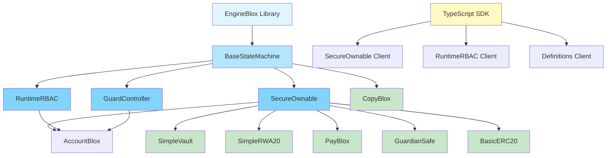

# Bloxchain Protocol: Enterprise-Grade Blockchain Security Framework

[](https://opensource.org/licenses/MPL-2.0)
[](https://soliditylang.org/)
[](./sdk/typescript/)
[](https://hardhat.org/)
[](https://sepolia.etherscan.io/)
[](https://particlecs.com/)

> **⚠️ EXPERIMENTAL SOFTWARE WARNING**  
> This repository contains experimental smart contract code. While the framework is feature-complete and tested, it is not yet audited for production use. Use at your own risk and do not deploy with real assets without proper security review.

## ⚡ Get started: create a wallet

After [foundation and CopyBlox are deployed](#deployment) on a network (e.g. Sepolia), you can create your own secure wallet (AccountBlox clone) in a few steps:

```bash
npm run create-wallet
```

The script is interactive: choose the network, **basic wallet (AccountBlox)** or a custom blox, then set owner / broadcaster / recovery and time-lock. It uses your `.env.deployment` deployer key and writes the new clone address (and Sepolia explorer link) when done.  
Non-interactive (all defaults): `CREATE_WALLET_USE_DEFAULTS=1 node scripts/deployment/create-wallet-copyblox.js`

## 🚀 What is Bloxchain Protocol?

Enterprise-grade security through **multi-phase workflows**: time-locked operations and meta-transactions with **role separation**, so contracts control storage and operations require at least two signatures. **EngineBlox** powers time-locks, gasless execution, and dynamic RBAC via modular composition.


*[SandBlox](https://sandblox.app/) – contract operations*

## 🏗️ Architecture Overview

### Core Components



### Modular composition

- **BaseStateMachine** → **SecureOwnable**, **RuntimeRBAC**, **GuardController** (and optional **HookManager**)
- **Template:** **AccountBlox** (see `contracts/examples/templates/`)
- **Examples:** SimpleVault, SimpleRWA20, PayBlox, **CopyBlox** (clone factory), GuardianSafe, BasicERC20

### Security model

- **Time-delay:** Request → wait → Approve (2 signatures). **Meta-tx:** Sign → Execute (role separation).
- **Roles:** Owner (admin, approve), Broadcaster (execute meta-tx, gas), Recovery (emergency).

## 🚀 Quick Start

**Prerequisites:** Node.js v18+

```bash
git clone https://github.com/PracticalParticle/Bloxchain-Protocol.git
cd Bloxchain-Protocol
npm install
npm run compile:foundry
npm run test:foundry
```

**SDK / contracts:** `npm install @bloxchain/sdk @bloxchain/contracts`  
**Networks:** Local (Hardhat), [Sepolia](https://sepolia.etherscan.io/), [SandBlox](https://sandblox.app/)

## Deployment

1. Copy `env.deployment.example` to `.env.deployment` and set `DEPLOY_RPC_URL`, `DEPLOY_PRIVATE_KEY`; optionally `DEPLOY_CHAIN_ID` (Sepolia: `11155111`) and `DEPLOY_NETWORK_NAME`.
2. **Foundation (libraries + AccountBlox):** `npm run deploy:hardhat:foundation`  
   Or: `npx hardhat run scripts/deployment/deploy-foundation-libraries.js --network sepolia`
3. **Example (CopyBlox):** `npx hardhat run scripts/deployment/deploy-example-copyblox.js --network sepolia`

Addresses are written to **`deployed-addresses.json`**.

### Deployed addresses

**Ethereum Sepolia (testnet)**

#### Foundation (libraries)

| Contract | Address |
|----------|---------|
| EngineBlox | [`0xd0db4bcfac215e86371c55ba9d91030082fe7adb`](https://sepolia.etherscan.io/address/0xd0db4bcfac215e86371c55ba9d91030082fe7adb) |
| SecureOwnableDefinitions | [`0xd21e88564377cbbed7885416cf0462b1a7e424aa`](https://sepolia.etherscan.io/address/0xd21e88564377cbbed7885416cf0462b1a7e424aa) |
| RuntimeRBACDefinitions | [`0x03156b0dcbd104c397aa3463705964b933ed4d3f`](https://sepolia.etherscan.io/address/0x03156b0dcbd104c397aa3463705964b933ed4d3f) |
| GuardControllerDefinitions | [`0x4b828c8575fcb375158d0926fd2ca01e5f41ca1f`](https://sepolia.etherscan.io/address/0x4b828c8575fcb375158d0926fd2ca01e5f41ca1f) |

#### Account

| Contract | Address |
|----------|---------|
| AccountBlox | [`0x5886d5760551fae5f826ebb71d5b8a125da57a15`](https://sepolia.etherscan.io/address/0x5886d5760551fae5f826ebb71d5b8a125da57a15) |

#### Examples

| Contract | Address |
|----------|---------|
| CopyBlox | [`0xc380cb5a483f32614365619ef9bbcf360f62836e`](https://sepolia.etherscan.io/address/0xc380cb5a483f32614365619ef9bbcf360f62836e) |

## 📖 Usage Examples

```typescript
import { SecureOwnable } from '@bloxchain/sdk';

const secureOwnable = new SecureOwnable(publicClient, walletClient, contractAddress, chain);

// Time-locked ownership transfer
await secureOwnable.transferOwnershipRequest({ from: ownerAddress });
await secureOwnable.transferOwnershipDelayedApproval(txId, { from: ownerAddress });
```

Meta-transactions (gasless) and Runtime RBAC examples: see [@bloxchain/sdk](https://www.npmjs.com/package/@bloxchain/sdk) and the repo `sdk/` and `test/` directories.

## 🔐 Runtime RBAC & GuardController

- **Runtime RBAC:** Dynamic roles via `roleConfigBatch`; function-level permissions (action bitmaps), protected system roles. Use `RuntimeRBAC` from `@bloxchain/sdk` for role creation and queries.
- **GuardController:** Controlled external calls: per-function target whitelist, time-lock/meta-tx workflows. Register schemas, whitelist targets, then execute via EngineBlox workflows. See `AccountBlox` and example contracts.

## 📋 Definition Data Layer

`IDefinition` supplies **function schemas** and **role permissions** as `pure` functions; definitions live in separate libraries to keep contract size down. See `contracts/.../lib/definitions/` and SDK for discovery.

## 🧪 Fuzz Testing

**37 suites, 309 tests** (state machine, meta-tx, RBAC, GuardController, payments, hooks, definitions, gas limits, composite attacks). See [test/foundry/docs](test/foundry/docs/) for the Attack Vectors Codex.

```bash
npm run test:foundry:fuzz
# Or: forge test --match-path "test/foundry/fuzz/ComprehensiveStateMachineFuzz.t.sol" --fuzz-runs 10000
```


## 🔧 Development Tools

**[SandBlox](https://sandblox.app/)** – Live contract interaction, multi-sig and meta-tx workflows, Sepolia support.

```bash
npm run compile:foundry          # compile; add :size for 24KB check
npm run test:foundry            # tests
npm run test:foundry:fuzz       # fuzz
npm run test:sanity:secure-ownable   # sanity (optional)
npm run docgen && npm run format    # docs & format
```

## 📚 Documentation

- [Protocol Architecture](./sdk/typescript/docs/bloxchain-architecture.md) · [State Machine](./sdk/typescript/docs/state-machine-engine.md) · [Getting Started](./sdk/typescript/docs/getting-started.md) · [API Reference](./sdk/typescript/docs/api-reference.md) · [SecureOwnable](./sdk/typescript/docs/secure-ownable.md) · [RuntimeRBAC](./sdk/typescript/docs/dynamic-rbac.md) · [Best Practices](./sdk/typescript/docs/best-practices.md) · [Examples](./sdk/typescript/docs/examples-basic.md)

## 🛡️ Security Features

- **Time-delay:** Request → (wait) → Approve → Execute. **Meta-tx:** Sign → Execute (signer ≠ executor).
- **EIP-712** structured data, per-signer nonces, time-lock enforcement. Function-level permissions: Request/Approve/Cancel, Sign/Execute, plus dynamic RBAC.

## 🌟 Key Benefits

**Developers:** No single-point failure; gasless meta-tx; runtime RBAC; type-safe SDK. **Enterprises:** Time-locks, audit trails, under-24KB contracts. **Users:** Recovery options, transparency.

## 🔬 Technical Specifications

**Stack:** Solidity 0.8.34, OpenZeppelin ^5.4.0 (upgradeable). **Libraries:** EngineBlox → BaseStateMachine → SecureOwnable, RuntimeRBAC, GuardController, HookManager. Contract size under 24KB; EIP-712; Viem-based TypeScript SDK. **Testing:** Foundry (fuzz + invariant), Hardhat, sanity scripts. All core components, template (AccountBlox), example apps, and Sepolia deployment are implemented and covered by tests.

## 🔮 Roadmap

Planned: **Formal verification**; **third-party security audit**.

## 🤝 Contributing

See [Contributing Guidelines](CONTRIBUTING.md) (setup, code standards, testing, security, PR process). Key requirements: [Code of Conduct](CODE_OF_CONDUCT.md), 100% test coverage, contracts under 24KB, `npm run format`. Deploy: `npm run deploy:hardhat` (local) or `npm run deploy:hardhat -- --network sepolia`.

## 📄 License

**MPL-2.0** – see [LICENSE](LICENSE). Covers core contracts (`contracts/core/`), SDK (`sdk/typescript/`), docs, tests, tooling. **Excluded:** `contracts/examples/` and `applications/` have their own licenses (see per-directory LICENSE files). Contributions under MPL-2.0; see [CONTRIBUTING.md](CONTRIBUTING.md).

## 🙏 Acknowledgments

[Particle CS](https://particlecs.com/), OpenZeppelin, Viem, Hardhat, Foundry.

## 📞 Support & Community

Docs: [`sdk/typescript/docs/`](./sdk/typescript/docs/). Examples: [`contracts/examples/`](./contracts/examples/). Testing: [SandBlox](https://sandblox.app/). [Issues](https://github.com/PracticalParticle/Bloxchain-Protocol/issues) · [Discussions](https://github.com/PracticalParticle/Bloxchain-Protocol/discussions).

---

Created by [Particle Crypto Security](https://particlecs.com/) · Copyright © 2025 Particle Crypto Security.