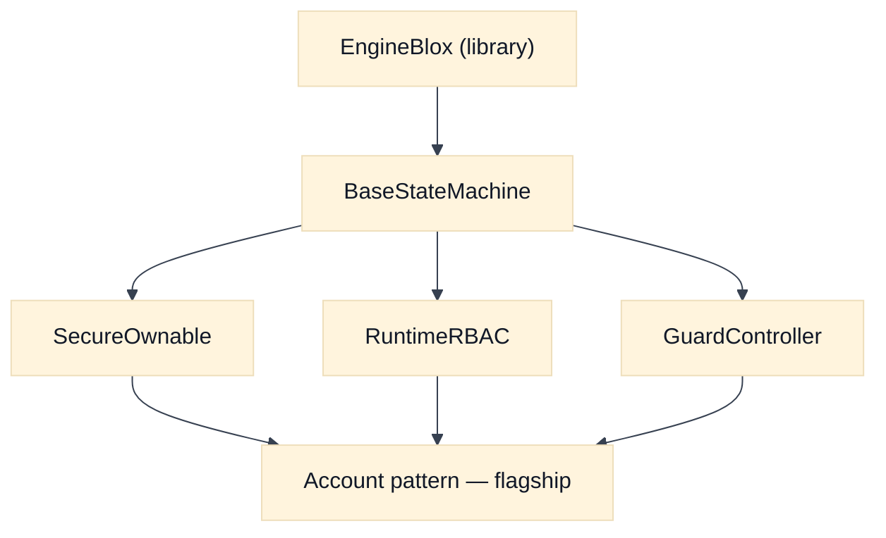

# Bloxchain Protocol

**Composable framework for secure Ethereum applications** — open-source (MPL-2.0) **state abstraction** via EngineBlox: a shared state machine plus optional components you compose into vaults, tokens, payment flows, factories, and full **Account**-style controllers.

[](https://opensource.org/licenses/MPL-2.0)
[](https://scorecard.dev/viewer/?uri=github.com/PracticalParticle/Bloxchain-Protocol)
[](https://github.com/PracticalParticle/Bloxchain-Protocol/actions/workflows/particle-ci.yml)
[](https://www.npmjs.com/package/@bloxchain/sdk)
[](https://soliditylang.org/)
[](https://sepolia.etherscan.io/)

<picture>
  <source media="(prefers-color-scheme: dark)" srcset="./docs/assets/hero-composition-framework.svg">
  
</picture>

> [!IMPORTANT]
> **Audit:** [`contracts/core/`](./contracts/core/) reviewed by [Nethermind](./audits/nethermind/) ([NM_0828 PDF](./audits/nethermind/Nethermind-Bloxchain-Core-NM_0828.pdf) · [policy](./contracts/core/AUDIT.md)). Full **framework** scope — not example apps under `contracts/examples/`.  
> **Networks:** Official deployments on **Sepolia** today; **Ethereum mainnet official deployments coming soon**.  
> **Platform:** [bloxchain.app](https://bloxchain.app) is alpha and testnet-first — see [documentation](https://docs.bloxchain.app).  
> **Security:** [SECURITY.md](./SECURITY.md)

## Build your application

Compose only the layers you need. The **[Account pattern](./docs/account-pattern.md)** (`AccountBlox`) is the **flagship** — all three core components — but many application types use a subset.

| I want to build… | Compose | Example in repo |
|------------------|---------|-----------------|
| Governed smart account / treasury | **Account** (SecureOwnable + RuntimeRBAC + GuardController) | [`AccountBlox`](./contracts/examples/templates/AccountBlox.sol) · `npm run create-wallet` |
| Asset vault (ETH / ERC-20) | **SecureOwnable** | [`SimpleVault`](./contracts/examples/applications/SimpleVault/) |
| Scheduled payments | **SecureOwnable** + payment APIs | [`PayBlox`](./contracts/examples/applications/PayBlox/) |
| RWA / governed token | **SecureOwnable** + ERC-20 | [`SimpleRWA20`](./contracts/examples/applications/SimpleRWA20/) |
| Clone factory for many instances | **BaseStateMachine** | [`CopyBlox`](./contracts/examples/applications/CopyBlox/) |
| Safe + extra policy | **SecureOwnable** + guard integration | [`GuardianSafe`](./contracts/examples/integrations/Safe/GuardianSafe/) |

More: [`contracts/examples/`](./contracts/examples/) · [Getting started](./docs/getting-started.md) · [State abstraction vs account abstraction](./docs/state-abstraction-vs-account-abstraction.md)

## Framework guarantees

The audited core (`contracts/core/`) is a **library architecture**, not a single monolithic app:

1. **Single mutation surface** — `SecureOperationState` mutated only by **EngineBlox** (linked via `DELEGATECALL`).
2. **Mandatory two-party authorization** — time-delay (request → approve) or meta-transaction (sign → execute; signer ≠ executor), enforced in architecture.
3. **Defense in depth** — redundant gates on handler vs execution selectors, permissions, and tx status before external calls.

Deeper treatment: [Protocol architecture](./docs/bloxchain-architecture.md) · [State machine engine](./docs/state-machine-engine.md) · [Technical overview](./TECHNICAL_OVERVIEW.md)

## Quick start (integrate)

**npm consumers:** Node.js **>=18.20.5** (see `sdk/typescript/package.json`).

```bash
npm install @bloxchain/sdk @bloxchain/contracts
```

```typescript
import { SecureOwnable } from '@bloxchain/sdk';

const secureOwnable = new SecureOwnable(publicClient, walletClient, contractAddress, chain);
const owner = await secureOwnable.owner();
```

**Build from source:** Node.js **>=22.12.0** for this monorepo — `git clone`, `npm install`, `npm run compile:foundry`, `npm run test:foundry`.

## Choose your path

| Goal | Start here |
|------|------------|
| Build an application | [Account pattern](./docs/account-pattern.md) · [Examples](./contracts/examples/) |
| Integrate via SDK | [Getting started](./docs/getting-started.md) · [@bloxchain/sdk on npm](https://www.npmjs.com/package/@bloxchain/sdk) |
| Try on Sepolia | [Sepolia & addresses](#sepolia--deployed-addresses) below |
| Security review | [AUDIT.md](./contracts/core/AUDIT.md) · [Nethermind report](./audits/nethermind/) |
| Contribute | [CONTRIBUTING.md](./CONTRIBUTING.md) (no public PRs to `contracts/core/`) |

## FAQ

<details>
<summary><strong>Is this only for smart accounts?</strong></summary>

No. Compose subsets of the core — vaults, tokens, factories, Safe integrations, and more live under [`contracts/examples/`](./contracts/examples/). The **Account pattern** is the flagship full composition (all three components).
</details>

<details>
<summary><strong>How is this different from ERC-4337 / smart wallets?</strong></summary>

Bloxchain provides **operation-level state abstraction** (time-locks, RBAC, guarded execution on-chain) — not wallet UX or bundler infrastructure. See [State abstraction vs account abstraction](./docs/state-abstraction-vs-account-abstraction.md).
</details>

<details>
<summary><strong>How is this different from OpenZeppelin AccessControl + Timelock?</strong></summary>

A unified transaction lifecycle (request → approve, meta-tx sign → execute), guarded external execution, function schemas, and a single audited **EngineBlox** state machine — not separate modules wired by convention.
</details>

<details>
<summary><strong>What did Nethermind audit?</strong></summary>

The full [`contracts/core/`](./contracts/core/) framework: EngineBlox, BaseStateMachine, SecureOwnable, RuntimeRBAC, GuardController, Account pattern, and definition libraries. Example apps under `contracts/examples/` are **out of scope**. [NM_0828 report](./audits/nethermind/) · [AUDIT.md](./contracts/core/AUDIT.md).
</details>

<details>
<summary><strong>Can I use this on mainnet today?</strong></summary>

**Official Protocol deployments** are on **Sepolia** today. **Ethereum mainnet official deployments are coming soon** — audit does not imply mainnet live. Hosted [bloxchain.app](https://bloxchain.app) is alpha and testnet-first; mainnet GA is on the Platform roadmap separately.
</details>

<details>
<summary><strong>Relationship to bloxchain.app?</strong></summary>

Same on-chain rules. The hosted Console is a separate product surface — full guides at [docs.bloxchain.app](https://docs.bloxchain.app).
</details>

## Bloxchain Platform

**[bloxchain.app](https://bloxchain.app)** — hosted Console for operating Bloxchain contracts in the browser (alpha, testnet-first). Guides: **[docs.bloxchain.app](https://docs.bloxchain.app)**.

## Architecture at a glance


```mermaid
%%{init: {'theme': 'base', 'themeVariables': {'primaryTextColor': '#111827', 'lineColor': '#374151'}}}%%
graph TB
  EB["EngineBlox (library)"]
  BSM["BaseStateMachine"]
  SO["SecureOwnable"]
  RBAC["RuntimeRBAC"]
  GC["GuardController"]
  ACC["Account pattern — flagship"]
  EB --> BSM
  BSM --> SO
  BSM --> RBAC
  BSM --> GC
  SO --> ACC
  RBAC --> ACC
  GC --> ACC
```

Full diagrams: [Architecture](./docs/bloxchain-architecture.md) · [State machine](./docs/state-machine-engine.md).

## Documentation

| Topic | Link |
|-------|------|
| Public docs (Platform + SDK + Protocol) | [docs.bloxchain.app](https://docs.bloxchain.app) |
| Account pattern (flagship) | [docs/account-pattern.md](./docs/account-pattern.md) |
| Getting started | [docs/getting-started.md](./docs/getting-started.md) |
| API reference | [docs/api-reference.md](./docs/api-reference.md) |
| Core audit policy | [contracts/core/AUDIT.md](./contracts/core/AUDIT.md) |

## Security & testing

- **Audit:** Nethermind NM_0828 for full `contracts/core/` — [report](./audits/nethermind/) · [SECURITY.md](./SECURITY.md)
- **Fuzz:** 37 suites, 309 tests — [Attack Vectors Codex](./test/foundry/docs/) · `npm run test:foundry:fuzz`

<details>
<summary><strong>Sepolia & deployed addresses</strong></summary>

### Try on Sepolia

After foundation is deployed:

```bash
npm run create-wallet
```

Interactive: choose network, **AccountBlox** or custom blox, set owner / broadcaster / recovery and time-lock. Uses `.env.deployment` and prints the clone address.

Non-interactive: `CREATE_WALLET_USE_DEFAULTS=1 node scripts/deployment/create-wallet-copyblox.js`

### Deployment

1. Copy `env.deployment.example` to `.env.deployment` — set `DEPLOY_RPC_URL`, `DEPLOY_PRIVATE_KEY`; Sepolia: `DEPLOY_CHAIN_ID=11155111`.
2. **Foundation:** `npm run deploy:hardhat:foundation`
3. **Example (CopyBlox):** `npx hardhat run scripts/deployment/deploy-example-copyblox.js --network sepolia`

Addresses are written to **`deployed-addresses.json`**.

### Official Sepolia addresses

| Contract | Address |
|----------|---------|
| EngineBlox | [`0x726d78c9683a96d66196d2b8350923e8ca0d8597`](https://sepolia.etherscan.io/address/0x726d78c9683a96d66196d2b8350923e8ca0d8597) |
| SecureOwnableDefinitions | [`0xcb8834e55c2c7b012e5643de98a1bf5fda22191c`](https://sepolia.etherscan.io/address/0xcb8834e55c2c7b012e5643de98a1bf5fda22191c) |
| RuntimeRBACDefinitions | [`0x27c103b2b1a1e7dc345aeff766aa3656b4825653`](https://sepolia.etherscan.io/address/0x27c103b2b1a1e7dc345aeff766aa3656b4825653) |
| GuardControllerDefinitions | [`0x6ce6f314fa35d34782f2743db4d0c1f824639938`](https://sepolia.etherscan.io/address/0x6ce6f314fa35d34782f2743db4d0c1f824639938) |
| AccountBlox | [`0x783eb64d7d5de55f6913f9cb42ef5a4c402884c0`](https://sepolia.etherscan.io/address/0x783eb64d7d5de55f6913f9cb42ef5a4c402884c0) |
| CopyBlox (example) | [`0x928a2bd6c13e4f48a0850d2171a8d79b29959fc7`](https://sepolia.etherscan.io/address/0x928a2bd6c13e4f48a0850d2171a8d79b29959fc7) |

### Usage example

```typescript
await secureOwnable.transferOwnershipRequest({ from: ownerAddress });
await secureOwnable.transferOwnershipDelayedApproval(txId, { from: ownerAddress });
```

Meta-transactions (EIP-712; optional relay per environment): [SDK docs](./docs/meta-transactions.md) · [examples](./docs/examples-basic.md).

</details>

<details>
<summary><strong>Development commands</strong></summary>

```bash
npm run compile:foundry          # add :size for 24KB check
npm run test:foundry
npm run test:e2e                 # SDK sanity on remote_evm
npm run docgen
```

See [CONTRIBUTING.md](./CONTRIBUTING.md) for the full command matrix.

</details>

## Contributing

Selective contributions welcome (docs, SDK aligned with core, tooling, examples) — **not** public PRs to **`contracts/core/`** (audited; Particle CS only). Security: [SECURITY.md](./SECURITY.md) only. DCO sign-off required (`git commit -s`). [Code of Conduct](./CODE_OF_CONDUCT.md).

## License

**MPL-2.0** — [LICENSE](./LICENSE). **`contracts/examples/`** use per-file licenses (typically MIT).

## Support

[GitHub Issues](https://github.com/PracticalParticle/Bloxchain-Protocol/issues) · [Discussions](https://github.com/PracticalParticle/Bloxchain-Protocol/discussions)

<details>
<summary><strong>Star History</strong></summary>

[](https://star-history.com/#PracticalParticle/Bloxchain-Protocol&Date)

</details>

---

Created by [Particle Crypto Security](https://particlecs.com/) · Copyright © 2025 Particle Crypto Security
