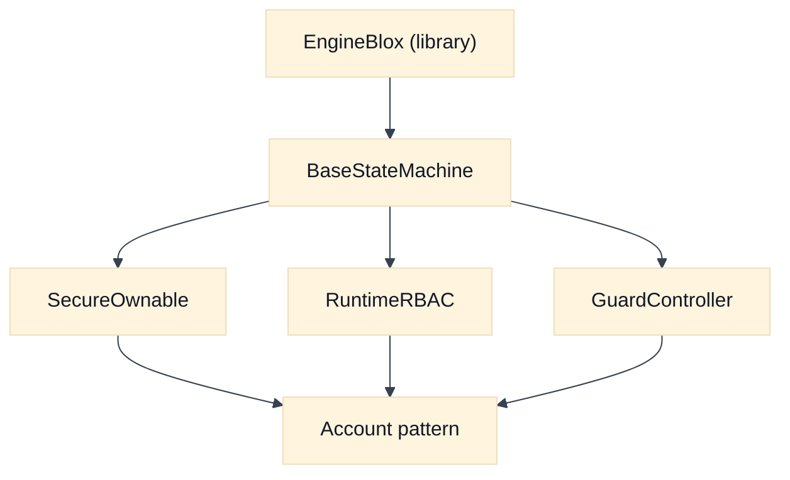

# Bloxchain Protocol

**Open-source security framework for Ethereum applications.**

Teams run sensitive on-chain actions through **roles, waiting periods, and auditable rules** — enforced on the blockchain, not only in a dashboard. MPL-2.0 · independently audited core · official deployments on **Sepolia** today.

<details>
<summary><strong>For integrators</strong> — technical category line</summary>

Composable on-chain framework: optional core components for vaults, tokens, payments, factories, and governed accounts — with separated authorization actions, RBAC, direct approval delays, meta-transactions, and guarded execution. See [architecture](#architecture-at-a-glance) and [what you can build](#what-you-can-build).

</details>

[](https://opensource.org/licenses/MPL-2.0)
[](https://scorecard.dev/viewer/?uri=github.com/PracticalParticle/Bloxchain-Protocol)
[](https://www.npmjs.com/package/@bloxchain/sdk)
[](https://github.com/PracticalParticle/Bloxchain-Protocol/actions/workflows/particle-ci.yml)
[](./audits/nethermind/Nethermind-Bloxchain-Core-NM_0828.pdf)
[](https://docs.bloxchain.app)
[](https://sepolia.etherscan.io/)

**Install:** `npm install @bloxchain/sdk` (TypeScript) · `npm install @bloxchain/contracts` (Solidity) · [choose a path](#quick-start)


<picture>
  <source media="(prefers-color-scheme: dark)" srcset="./docs/assets/hero-composition-framework.svg">
  
</picture>

> [!IMPORTANT]
> **Audited core:** [`contracts/core/`](./contracts/core/) — [Nethermind NM_0828](./audits/nethermind/Nethermind-Bloxchain-Core-NM_0828.pdf) ([policy](./contracts/core/AUDIT.md)). Example apps under `contracts/examples/` are **out of scope**.  
> **Official deployments:** **Sepolia** today; **Ethereum mainnet official deployments coming soon**. Audit does not imply mainnet is live.  
> **Security:** [SECURITY.md](./SECURITY.md) · Optional hosted Console: [bloxchain.app](https://bloxchain.app) (alpha, testnet-first) — [docs](https://docs.bloxchain.app).

## Who uses this

| I am… | I need… | Start here |
|-------|---------|------------|
| **Building smart contracts** (Solidity) | Audited components to compose into my app | [What you can build](#what-you-can-build) · [`@bloxchain/contracts`](https://www.npmjs.com/package/@bloxchain/contracts) |
| **Integrating from my product** (TypeScript) | Typed clients for deployed contracts | [Integrate with the SDK](#integrate-with-the-sdk) · [Getting started](./docs/getting-started.md) |
| **Deploying a governed account** (testnet) | A working account on Sepolia | [Deploy on Sepolia](#deploy-on-sepolia) |
| **Reviewing security** | Audit scope and architecture | [Nethermind report](./audits/nethermind/) · [AUDIT.md](./contracts/core/AUDIT.md) · [Architecture](#architecture-at-a-glance) |
| **Evaluating for my organization** | Plain-language fit and product context | [docs.bloxchain.app](https://docs.bloxchain.app) · [Particle CS](https://particlecs.com/) |

The optional hosted Console ([bloxchain.app](https://bloxchain.app)) uses the **same on-chain rules** — not required to use the open protocol.

## Quick start

Pick one path. Node.js **>=18.20.5** for npm packages (`sdk/typescript/package.json`).

### Deploy on Sepolia

Deploy a **governed account** (full on-chain stack: ownership, roles, and execution rules):

```bash
npm run create-wallet
```

Uses **AccountBlox** after foundation is deployed. See [Account pattern](./docs/account-pattern.md) · [Sepolia addresses](#sepolia--deployed-addresses).

### Integrate with the SDK

```bash
npm install @bloxchain/sdk
```

```typescript
import { SecureOwnable } from '@bloxchain/sdk';

const secureOwnable = new SecureOwnable(publicClient, walletClient, contractAddress, chain);

// Request must come from RECOVERY_ROLE (new owner is snapshotted from getRecovery() at request time)
const request = await secureOwnable.transferOwnershipRequest({ from: recoveryAddress });
await request.wait();

const pending = await secureOwnable.getPendingTransactions();
const txId = pending[pending.length - 1];
const record = await secureOwnable.getTransaction(txId);

// After record.releaseTime, owner or recovery may approve on the direct delayed path
await secureOwnable.transferOwnershipDelayedApproval(txId, { from: ownerAddress });
```

Sign in browser; optional relay per environment — [meta-transactions](./docs/meta-transactions.md) · [examples](./docs/examples-basic.md).

### Build smart contracts

Install contracts package and compile from this monorepo (Node.js **>=22.12.0**):

```bash
npm install @bloxchain/contracts
```

```bash
git clone https://github.com/PracticalParticle/Bloxchain-Protocol.git
cd Bloxchain-Protocol
npm install
npm run compile:foundry
npm run test:foundry
```

Extend patterns under [`contracts/examples/`](./contracts/examples/). Pin exact versions in production — [VERSIONING](./docs/VERSIONING.md).

## What you can build

For **Solidity developers** — compose only what you need. The **[Account pattern](./docs/account-pattern.md)** wires all three core components; most apps use a **subset**.

| I want to build… | In plain terms | Protocol pieces | Example |
|------------------|----------------|-----------------|---------|
| Governed smart account / treasury | Full account stack with roles and execution rules | Account (SecureOwnable + RuntimeRBAC + GuardController) | [`AccountBlox`](./contracts/examples/templates/AccountBlox.sol) · `create-wallet` |
| Asset vault (ETH / ERC-20) | Vault with ownership controls | SecureOwnable | [`SimpleVault`](./contracts/examples/applications/SimpleVault/) |
| Scheduled payments | Payments with approval workflow | SecureOwnable | [`PayBlox`](./contracts/examples/applications/PayBlox/) |
| RWA / governed token | Token with on-chain governance | SecureOwnable + ERC-20 | [`SimpleRWA20`](./contracts/examples/applications/SimpleRWA20/) |
| Clone factory | Many instances from one template | BaseStateMachine | [`CopyBlox`](./contracts/examples/applications/CopyBlox/) |
| Safe + extra policy | Safe with added on-chain rules | SecureOwnable + guard | [`GuardianSafe`](./contracts/examples/integrations/Safe/GuardianSafe/) |

More: [`contracts/examples/`](./contracts/examples/) · [State abstraction vs account abstraction](./docs/state-abstraction-vs-account-abstraction.md)

## Architecture at a glance

On-chain rules flow through a shared state engine into optional components; the **Account pattern** combines all three.


```mermaid
%%{init: {'theme': 'base', 'themeVariables': {'primaryTextColor': '#111827', 'lineColor': '#374151'}}}%%
graph TB
  EB["EngineBlox (library)"]
  BSM["BaseStateMachine"]
  SO["SecureOwnable"]
  RBAC["RuntimeRBAC"]
  GC["GuardController"]
  ACC["Account pattern"]
  EB --> BSM
  BSM --> SO
  BSM --> RBAC
  BSM --> GC
  SO --> ACC
  RBAC --> ACC
  GC --> ACC
```

Full diagrams: [Architecture](./docs/bloxchain-architecture.md) · [State machine](./docs/state-machine-engine.md) · [Technical overview](./TECHNICAL_OVERVIEW.md)

<details>
<summary><strong>Architecture guarantees (protocol engineers)</strong></summary>

The audited core (`contracts/core/`) is a **library architecture**, not a single monolithic app:

1. **Single mutation surface** — `SecureOperationState` mutated only by **EngineBlox** (linked via `DELEGATECALL`).
2. **Distinct authorization actions** — direct approval can enforce a delay; meta-transaction approval separates signing from submission but does not inherit that delay. Effective separation depends on wallet-to-role assignments.
3. **Defense in depth** — redundant gates on handler vs execution selectors, permissions, and tx status before external calls.

</details>

## Documentation

| Topic | Link |
|-------|------|
| Public docs (Platform + SDK + Protocol) | [docs.bloxchain.app](https://docs.bloxchain.app) |
| Protocol technical thesis | [WHITEPAPER.md](./WHITEPAPER.md) |
| Account pattern | [docs/account-pattern.md](./docs/account-pattern.md) |
| Getting started (SDK) | [docs/getting-started.md](./docs/getting-started.md) |
| API reference | [docs/api-reference.md](./docs/api-reference.md) |
| Core audit policy | [contracts/core/AUDIT.md](./contracts/core/AUDIT.md) |

<details>
<summary><strong>FAQ — for organizations</strong></summary>

**What is Bloxchain in one sentence?**  
An open-source framework so teams run blockchain operations through auditable on-chain rules — roles, waiting periods, and controlled external calls — instead of ad-hoc signing.

**Can we use this on mainnet today?**  
Official Protocol deployments are on **Sepolia** today. **Ethereum mainnet official deployments are coming soon.** Completing an audit does not mean mainnet is live.

**What is bloxchain.app?**  
An optional hosted Console to operate governed accounts in the browser (alpha, testnet-first). Same on-chain rules as self-hosted integrations — [docs.bloxchain.app](https://docs.bloxchain.app).

**What was audited?**  
The Protocol **core framework** (not every example app). [Nethermind NM_0828](./audits/nethermind/) · [AUDIT.md](./contracts/core/AUDIT.md).

</details>

<details>
<summary><strong>FAQ — for developers</strong></summary>

**Is this only for smart accounts?**  
No. See [what you can build](#what-you-can-build) — vaults, tokens, factories, and Safe integrations compose subsets of the core.

**How is this different from ERC-4337 / smart wallets?**  
Operation-level governed workflows on-chain — not wallet UX or bundler infrastructure. [State abstraction vs account abstraction](./docs/state-abstraction-vs-account-abstraction.md).

**Are meta-transactions timelocked?**

Not by the core meta-transaction approval path. Direct approval enforces `releaseTime`; meta approval uses separately permissioned signing and submission. See the [technical paper](./WHITEPAPER.md#33-direct-delay-and-meta-authorization-are-different-policies).

**How is this different from OpenZeppelin AccessControl + Timelock?**  
Unified transaction lifecycle (request → approve, sign → execute), guarded external execution, function schemas, and a single audited **EngineBlox** state machine.

**Can I contribute to `contracts/core/`?**  
No public PRs — audited core is maintained by Particle CS. See [CONTRIBUTING.md](./CONTRIBUTING.md) for docs, SDK, tooling, and examples.

</details>

<details id="sepolia--deployed-addresses">
<summary><strong>Sepolia & deployed addresses</strong></summary>

### Try on Sepolia

```bash
npm run create-wallet
```

Interactive: choose network, **AccountBlox** or custom blox, set owner / broadcaster / recovery and time-lock. Uses `.env.deployment` and prints the clone address.

Non-interactive: `CREATE_WALLET_USE_DEFAULTS=1 node scripts/deployment/create-wallet-copyblox.js`

### Deployment

1. Copy `env.deployment.example` to `.env.deployment` — set `DEPLOY_RPC_URL`, `DEPLOY_PRIVATE_KEY`; Sepolia: `DEPLOY_CHAIN_ID=11155111`.
2. **Foundation:** `npm run deploy:hardhat:foundation`
3. **Example (CopyBlox):** `npx hardhat run scripts/deployment/deploy-example-copyblox.js --network sepolia`

Addresses are written to **`deployed-addresses.json`**.

### Official Sepolia addresses

| Contract | Address |
|----------|---------|
| EngineBlox | [`0x726d78c9683a96d66196d2b8350923e8ca0d8597`](https://sepolia.etherscan.io/address/0x726d78c9683a96d66196d2b8350923e8ca0d8597) |
| SecureOwnableDefinitions | [`0xcb8834e55c2c7b012e5643de98a1bf5fda22191c`](https://sepolia.etherscan.io/address/0xcb8834e55c2c7b012e5643de98a1bf5fda22191c) |
| RuntimeRBACDefinitions | [`0x27c103b2b1a1e7dc345aeff766aa3656b4825653`](https://sepolia.etherscan.io/address/0x27c103b2b1a1e7dc345aeff766aa3656b4825653) |
| GuardControllerDefinitions | [`0x6ce6f314fa35d34782f2743db4d0c1f824639938`](https://sepolia.etherscan.io/address/0x6ce6f314fa35d34782f2743db4d0c1f824639938) |
| AccountBlox | [`0x783eb64d7d5de55f6913f9cb42ef5a4c402884c0`](https://sepolia.etherscan.io/address/0x783eb64d7d5de55f6913f9cb42ef5a4c402884c0) |
| CopyBlox (example) | [`0x928a2bd6c13e4f48a0850d2171a8d79b29959fc7`](https://sepolia.etherscan.io/address/0x928a2bd6c13e4f48a0850d2171a8d79b29959fc7) |

</details>

<details>
<summary><strong>Development & testing</strong></summary>

```bash
npm run compile:foundry          # add :size for 24KB check
npm run test:foundry
npm run test:foundry:fuzz        # 37 suites, 309 tests — see test/foundry/docs/
npm run test:e2e                 # SDK sanity on remote_evm
npm run docgen
```

See [CONTRIBUTING.md](./CONTRIBUTING.md) for the full command matrix.

</details>

## Contributing

Selective contributions welcome (docs, SDK aligned with core, tooling, examples) — **not** public PRs to **`contracts/core/`** (audited; Particle CS only). Security: [SECURITY.md](./SECURITY.md) only. DCO sign-off required (`git commit -s`). [Code of Conduct](./CODE_OF_CONDUCT.md).

## License

**MPL-2.0** — [LICENSE](./LICENSE). **`contracts/examples/`** use per-file licenses (typically MIT).

## Support

[GitHub Issues](https://github.com/PracticalParticle/Bloxchain-Protocol/issues) · [Discussions](https://github.com/PracticalParticle/Bloxchain-Protocol/discussions)

<details>
<summary><strong>Star History</strong></summary>

[](https://star-history.com/#PracticalParticle/Bloxchain-Protocol&Date)

</details>

---

Created by [Particle Crypto Security](https://particlecs.com/) · Copyright © 2025 Particle Crypto Security
