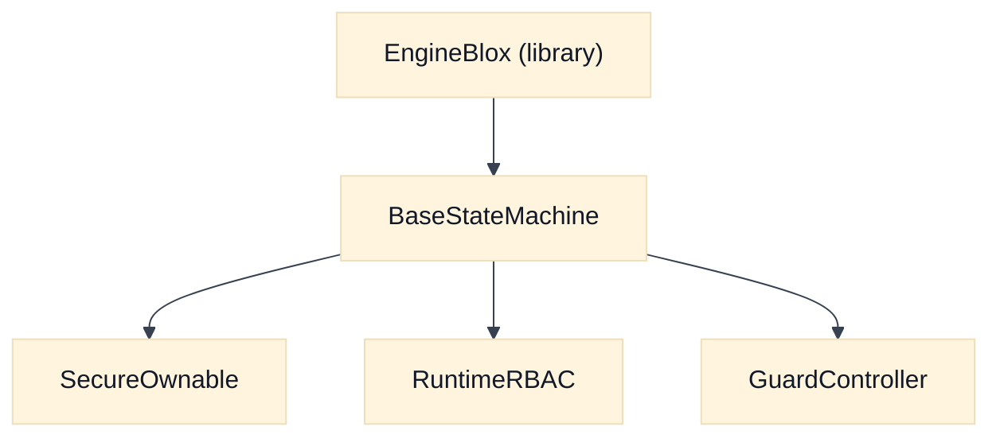

# Bloxchain Protocol

**Governed smart contract security on Ethereum** — open-source (MPL-2.0) upgradeable account primitives: RBAC, timelocks, guarded execution, and EIP-712 meta-transactions enforced on-chain.

[](https://opensource.org/licenses/MPL-2.0)
[](https://github.com/PracticalParticle/Bloxchain-Protocol/actions/workflows/particle-ci.yml)
[](https://www.npmjs.com/package/@bloxchain/sdk)
[](https://soliditylang.org/)
[](https://sepolia.etherscan.io/)

> [!IMPORTANT]
> **Audit:** [`contracts/core/`](./contracts/core/) reviewed by [Nethermind](./audits/nethermind/) ([NM_0828 PDF](./audits/nethermind/Nethermind-Bloxchain-Core-NM_0828.pdf) · [policy](./contracts/core/AUDIT.md)).  
> **Networks:** Official deployments on **Sepolia** today; **Ethereum mainnet official deployments coming soon**.  
> **Platform:** [bloxchain.app](https://bloxchain.app) is alpha and testnet-first — see [documentation](https://docs.bloxchain.app).  
> **Security:** [SECURITY.md](./SECURITY.md)

## Table of contents

- [What you get](#what-you-get)
- [Quick start (integrate)](#quick-start-integrate)
- [Choose your path](#choose-your-path)
- [Bloxchain Platform](#bloxchain-platform)
- [Try on Sepolia](#try-on-sepolia)
- [Deployed addresses](#deployed-addresses)
- [Usage example](#usage-example)
- [Architecture at a glance](#architecture-at-a-glance)
- [Documentation](#documentation)
- [Security & testing](#security--testing)
- [Development](#development)
- [Contributing](#contributing)
- [License](#license)
- [Support](#support)

## What you get

The protocol’s security posture rests on three principles:

1. **Single source of mutation** — all mutable state in one `SecureOperationState`; only **EngineBlox** may mutate it.
2. **Mandatory two-signature authorization** — every state change requires two distinct parties (time-delay **or** meta-transaction signer ≠ executor), enforced in architecture.
3. **Defense in depth** — redundant gates on identity, permissions, and storage invariants.

Deeper treatment: [Protocol architecture](./docs/bloxchain-architecture.md) · [State machine engine](./docs/state-machine-engine.md).

## Quick start (integrate)

**npm consumers:** Node.js **>=18.20.5** (see `sdk/typescript/package.json`).

```bash
npm install @bloxchain/sdk @bloxchain/contracts
```

```typescript
import { SecureOwnable } from '@bloxchain/sdk';

const secureOwnable = new SecureOwnable(publicClient, walletClient, contractAddress, chain);
const owner = await secureOwnable.owner();
```

**Build from source:** Node.js **>=22.12.0** for this monorepo.

```bash
git clone https://github.com/PracticalParticle/Bloxchain-Protocol.git
cd Bloxchain-Protocol
npm install
npm run compile:foundry
npm run test:foundry
```

## Choose your path

| Goal | Start here |
|------|------------|
| Integrate via SDK | [Getting started](./docs/getting-started.md) · [@bloxchain/sdk on npm](https://www.npmjs.com/package/@bloxchain/sdk) |
| Try on Sepolia | [Create a wallet](#try-on-sepolia) · [deployed addresses](#deployed-addresses) |
| Security review | [AUDIT.md](./contracts/core/AUDIT.md) · [Nethermind report](./audits/nethermind/) · [Technical overview](./TECHNICAL_OVERVIEW.md) |
| Contribute | [CONTRIBUTING.md](./CONTRIBUTING.md) (no public PRs to `contracts/core/`) |

## Bloxchain Platform

**[bloxchain.app](https://bloxchain.app)** is the hosted Console for operating Bloxchain contracts in the browser (alpha, testnet-first).

Full guides: **[docs.bloxchain.app](https://docs.bloxchain.app)** — Platform, SDK, and Protocol docs share the same on-chain rules.

## Try on Sepolia

After [foundation is deployed](#deployment) on Sepolia:

```bash
npm run create-wallet
```

Interactive: choose network, **AccountBlox** or custom blox, set owner / broadcaster / recovery and time-lock. Uses `.env.deployment` and prints the clone address.

Non-interactive: `CREATE_WALLET_USE_DEFAULTS=1 node scripts/deployment/create-wallet-copyblox.js`

## Deployment

1. Copy `env.deployment.example` to `.env.deployment` — set `DEPLOY_RPC_URL`, `DEPLOY_PRIVATE_KEY`; Sepolia: `DEPLOY_CHAIN_ID=11155111`.
2. **Foundation:** `npm run deploy:hardhat:foundation`
3. **Example (CopyBlox):** `npx hardhat run scripts/deployment/deploy-example-copyblox.js --network sepolia`

Addresses are written to **`deployed-addresses.json`**.

### Deployed addresses

**Ethereum Sepolia (official deployments)**

| Contract | Address |
|----------|---------|
| EngineBlox | [`0x726d78c9683a96d66196d2b8350923e8ca0d8597`](https://sepolia.etherscan.io/address/0x726d78c9683a96d66196d2b8350923e8ca0d8597) |
| SecureOwnableDefinitions | [`0xcb8834e55c2c7b012e5643de98a1bf5fda22191c`](https://sepolia.etherscan.io/address/0xcb8834e55c2c7b012e5643de98a1bf5fda22191c) |
| RuntimeRBACDefinitions | [`0x27c103b2b1a1e7dc345aeff766aa3656b4825653`](https://sepolia.etherscan.io/address/0x27c103b2b1a1e7dc345aeff766aa3656b4825653) |
| GuardControllerDefinitions | [`0x6ce6f314fa35d34782f2743db4d0c1f824639938`](https://sepolia.etherscan.io/address/0x6ce6f314fa35d34782f2743db4d0c1f824639938) |
| AccountBlox | [`0x783eb64d7d5de55f6913f9cb42ef5a4c402884c0`](https://sepolia.etherscan.io/address/0x783eb64d7d5de55f6913f9cb42ef5a4c402884c0) |
| CopyBlox (example) | [`0x928a2bd6c13e4f48a0850d2171a8d79b29959fc7`](https://sepolia.etherscan.io/address/0x928a2bd6c13e4f48a0850d2171a8d79b29959fc7) |

## Usage example

```typescript
// Time-locked ownership transfer
await secureOwnable.transferOwnershipRequest({ from: ownerAddress });
await secureOwnable.transferOwnershipDelayedApproval(txId, { from: ownerAddress });
```

Meta-transactions (EIP-712; optional relay per environment) and Runtime RBAC: [SDK docs](./docs/meta-transactions.md) · [examples](./docs/examples-basic.md).

## Architecture at a glance


```mermaid
%%{init: {'theme': 'base', 'themeVariables': {'primaryTextColor': '#111827', 'lineColor': '#374151'}}}%%
graph TB
  EB["EngineBlox (library)"]
  BSM["BaseStateMachine"]
  SO["SecureOwnable"]
  RBAC["RuntimeRBAC"]
  GC["GuardController"]
  EB --> BSM
  BSM --> SO
  BSM --> RBAC
  BSM --> GC
```

Full diagrams and transaction lifecycle: [Architecture](./docs/bloxchain-architecture.md) · [State machine](./docs/state-machine-engine.md).

## Documentation

| Topic | Link |
|-------|------|
| Public docs (Platform + SDK + Protocol) | [docs.bloxchain.app](https://docs.bloxchain.app) |
| Getting started | [docs/getting-started.md](./docs/getting-started.md) |
| API reference | [docs/api-reference.md](./docs/api-reference.md) |
| Versioning | [docs/VERSIONING.md](./docs/VERSIONING.md) |
| Core audit policy | [contracts/core/AUDIT.md](./contracts/core/AUDIT.md) |
| Generated NatSpec | [docs/](./docs/) (`npm run docgen`) |

## Security & testing

- **Audit:** Nethermind NM_0828 for `contracts/core/` — [report](./audits/nethermind/) · [SECURITY.md](./SECURITY.md)
- **Fuzz:** 37 suites, 309 tests — [Attack Vectors Codex](./test/foundry/docs/) · `npm run test:foundry:fuzz`

## Development

```bash
npm run compile:foundry          # add :size for 24KB check
npm run test:foundry
npm run test:e2e                 # SDK sanity on remote_evm
npm run docgen
```

See [CONTRIBUTING.md](./CONTRIBUTING.md) for full command matrix and contribution policy.

## Contributing

Selective contributions welcome (docs, SDK aligned with core, tooling, examples) — **not** public PRs to **`contracts/core/`** (audited; Particle CS only). Security: [SECURITY.md](./SECURITY.md) only. DCO sign-off required (`git commit -s`). [Code of Conduct](./CODE_OF_CONDUCT.md).

## License

**MPL-2.0** — [LICENSE](./LICENSE). Covers core, SDK, docs, tests, tooling. **`contracts/examples/`** use per-file licenses (typically MIT).

## Support

[GitHub Issues](https://github.com/PracticalParticle/Bloxchain-Protocol/issues) · [Discussions](https://github.com/PracticalParticle/Bloxchain-Protocol/discussions) · Examples: [`contracts/examples/`](./contracts/examples/)

---

Created by [Particle Crypto Security](https://particlecs.com/) · Copyright © 2025 Particle Crypto Security
