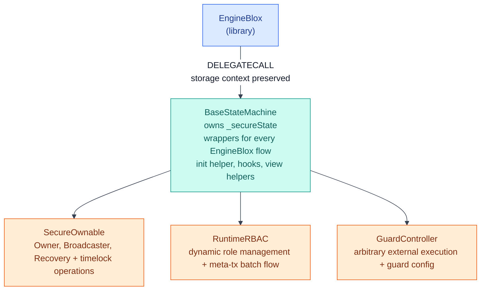
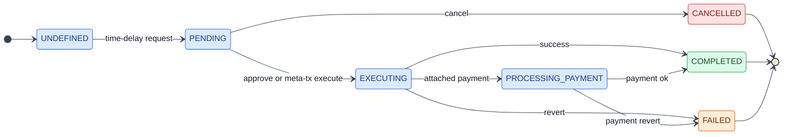

# Bloxchain Protocol: Enterprise-Grade Blockchain Security Framework

[](https://opensource.org/licenses/MPL-2.0)
[](https://soliditylang.org/)
[](./sdk/typescript/)
[](https://hardhat.org/)
[](https://sepolia.etherscan.io/)
[](https://particlecs.com/)

> **Security audit status:** A third-party security audit of the protocol smart contracts is in progress; no independent audit report has been published yet.

## System overview

The protocol’s security posture rests on three principles:

1. **Single source of mutation.** All mutable state lives in one struct (`SecureOperationState`), instantiated once per deployed contract. Only the **EngineBlox** library may mutate it, which isolates invariants to a single audit surface.

2. **Mandatory two-signature authorization.** Every state-changing operation must be authorized by at least two distinct parties—either **across time** (request now, approve later, with a window to intervene) or **across roles** (signer ≠ executor for meta-transactions). This is enforced **architecturally**, not by convention.

3. **Defense in depth via redundant gates.** Where one check could suffice, the protocol layers two or more checks on the same property from different angles: identity vs. role membership, permission grant vs. handler/execution wiring, storage status vs. structural invariants. A single compromised layer cannot bypass the others.

Deeper treatment: [Protocol architecture](./docs/bloxchain-architecture.md) · [State machine engine](./docs/state-machine-engine.md).

## ⚡ Get started: create a wallet

After [foundation and CopyBlox are deployed](#deployment) on a network (e.g. Sepolia), you can create your own secure wallet (AccountBlox clone) in a few steps:

```bash
npm run create-wallet
```

The script is interactive: choose the network, **basic wallet (AccountBlox)** or a custom blox, then set owner / broadcaster / recovery and time-lock. It uses your `.env.deployment` deployer key and writes the new clone address (and Sepolia explorer link) when done.  
Non-interactive (all defaults): `CREATE_WALLET_USE_DEFAULTS=1 node scripts/deployment/create-wallet-copyblox.js`

## 🚀 What is Bloxchain Protocol?

Enterprise-grade security through **multi-phase workflows**: time-locked operations and meta-transactions with **role separation**, so contracts control storage and operations require at least two parties. **EngineBlox** powers time-locks, gasless execution, and dynamic RBAC via modular composition (see **System overview** above).

## 🏗️ Architecture Overview

### Component layering

| Layer | Role |
|--------|------|
| **EngineBlox** (library) | Linked into integrators via `DELEGATECALL` (storage context = `address(this)` of the caller). Mutates only the `SecureOperationState` reference passed in; owns no storage of its own. |
| **BaseStateMachine** | The only contract that declares `_secureState`. Exposes wrappers, init helpers, hooks, and view helpers for every EngineBlox flow. |
| **SecureOwnable** | Owner, Broadcaster, Recovery, and timelock-oriented operations. |
| **RuntimeRBAC** | Dynamic role management and meta-transaction batch flows. |
| **GuardController** | Arbitrary external execution paths and guard configuration (within protocol rules). |

The framework is organized as **three tiers**: a stateless library at the top, a **single base contract** that owns the protocol storage, and **three composable components** that each add a slice of the public surface (plus definitions libraries for function schemas and default permission grants).

**Concrete deployable contracts** inherit whichever pieces they need. A wallet-style contract typically composes all three components; a vault, ERC-20, or payment scheduler may inherit only **SecureOwnable**; a clone factory may inherit only **BaseStateMachine**. Composition is per deployment—the framework does not mandate one pattern.

### Core Components


```mermaid
%%{init: {'theme': 'base', 'themeVariables': {'primaryTextColor': '#111827', 'lineColor': '#374151', 'edgeLabelBackground': '#ffffff', 'edgeLabelTextColor': '#111827'}}}%%
graph TB
  EB["EngineBlox<br/>(library)"]
  BSM["BaseStateMachine<br/>owns _secureState<br/>wrappers for every EngineBlox flow<br/>init helper, hooks, view helpers"]
  SO["SecureOwnable<br/>Owner, Broadcaster, Recovery + timelock operations"]
  RBAC["RuntimeRBAC<br/>dynamic role management + meta-tx batch flow"]
  GC["GuardController<br/>arbitrary external execution + guard config"]

  EB -->|DELEGATECALL<br/>storage context preserved| BSM
  BSM --> SO
  BSM --> RBAC
  BSM --> GC

  style EB fill:#dbeafe,color:#1e3a8a,stroke:#2563eb
  style BSM fill:#ccfbf1,color:#115e59,stroke:#0d9488
  style SO fill:#ffedd5,color:#7c2d12,stroke:#ea580c
  style RBAC fill:#ffedd5,color:#7c2d12,stroke:#ea580c
  style GC fill:#ffedd5,color:#7c2d12,stroke:#ea580c
```

### Modular composition

- **BaseStateMachine** → **SecureOwnable**, **RuntimeRBAC**, **GuardController** (optional **HookManager** in `contracts/experimental/`)
- **Account** pattern composes all three components → **AccountBlox** template (`contracts/examples/templates/`)
- **Examples:** SimpleVault, SimpleRWA20, PayBlox (**SecureOwnable** only); **CopyBlox** (**BaseStateMachine** only); GuardianSafe (**SecureOwnable** + Safe guard); BasicERC20 (standalone ERC20, typically minted by AccountBlox)

### Transaction lifecycle

Every operation is a **TxRecord** keyed by a monotonically increasing **txId**, with a single **TxStatus** (Solidity enum order): `UNDEFINED`, `PENDING`, `EXECUTING`, `PROCESSING_PAYMENT`, `CANCELLED`, `COMPLETED`, `FAILED`.


```mermaid
%%{init: {'theme': 'base', 'themeVariables': {'primaryTextColor': '#111827', 'lineColor': '#374151', 'edgeLabelBackground': '#ffffff', 'edgeLabelTextColor': '#111827'}}}%%
stateDiagram-v2
  direction LR

  classDef active fill:#dbeafe,color:#1e3a8a,stroke:#2563eb
  classDef terminal fill:#dcfce7,color:#14532d,stroke:#16a34a
  classDef cancelled fill:#fee2e2,color:#7f1d1d,stroke:#dc2626
  classDef failed fill:#ffedd5,color:#7c2d12,stroke:#ea580c

  [*] --> UNDEFINED
  UNDEFINED --> PENDING: time-delay request
  PENDING --> CANCELLED: cancel
  PENDING --> EXECUTING: approve or meta-tx execute
  EXECUTING --> COMPLETED: success
  EXECUTING --> FAILED: revert
  EXECUTING --> PROCESSING_PAYMENT: attached payment
  PROCESSING_PAYMENT --> COMPLETED: payment ok
  PROCESSING_PAYMENT --> FAILED: payment revert
  CANCELLED --> [*]
  COMPLETED --> [*]
  FAILED --> [*]

  class UNDEFINED,PENDING,EXECUTING,PROCESSING_PAYMENT active
  class COMPLETED terminal
  class CANCELLED cancelled
  class FAILED failed
```

Two workflow patterns share the same **PENDING → EXECUTING → terminal** progression (`COMPLETED`, `FAILED`, or `CANCELLED`); they differ in how authorization is supplied and whether a wait window applies.

- **Time-delay flow.** A party with **EXECUTE_TIME_DELAY_REQUEST** creates a `PENDING` record with `releaseTime = block.timestamp + timeLockPeriodSec`. After the window, a party with **EXECUTE_TIME_DELAY_APPROVE** advances the record through `EXECUTING` to a terminal state. **EXECUTE_TIME_DELAY_CANCEL** can move to `CANCELLED` during the window.

- **Meta-transaction flow.** A signer with `SIGN_META_*` permission produces an **EIP-712** signature off-chain over the full `MetaTransaction` struct. An executor with `EXECUTE_META_*` permission submits it on-chain. EngineBlox runs integrity checks (signature length, chain ID, deadline, gas price, nonce, handler binding, signer permission dual check, ECDSA recovery), increments the signer nonce, and completes the lifecycle in one call.

- **Fused “request-and-approve” meta-tx.** Used where the protocol omits a time-delay (e.g. recovery rotation, time-lock change, role-config batch, guard-config batch): two-signature property is preserved via signer vs executor, without a separate on-chain wait window.

**External execution:** the transition to **`EXECUTING`** is the only point at which the protocol invokes arbitrary external code.

### Security model (roles)

- **Time-delay:** Request → wait → Approve (two steps / two parties). **Meta-tx:** Sign → Execute (signer ≠ executor).
- **Roles:** Owner (admin, approve), Broadcaster (execute meta-tx, gas), Recovery (emergency).

## 🚀 Quick Start

**Prerequisites:** Node.js **>=18.20.5** (required for published `@bloxchain/sdk` ESM JSON import attributes; enforced via `engines` + `.npmrc` `engine-strict=true`)

```bash
git clone https://github.com/PracticalParticle/Bloxchain-Protocol.git
cd Bloxchain-Protocol
npm install
npm run compile:foundry
npm run test:foundry
```

**SDK / contracts:** `npm install @bloxchain/sdk @bloxchain/contracts`  
**Networks:** Local (Hardhat), [Sepolia](https://sepolia.etherscan.io/)

## Deployment

1. Copy `env.deployment.example` to `.env.deployment` and set `DEPLOY_RPC_URL`, `DEPLOY_PRIVATE_KEY`; optionally `DEPLOY_CHAIN_ID` (Sepolia: `11155111`) and `DEPLOY_NETWORK_NAME`.
2. **Foundation (libraries + AccountBlox):** `npm run deploy:hardhat:foundation`  
   Or: `npx hardhat run scripts/deployment/deploy-foundation-libraries.js --network sepolia`
3. **Example (CopyBlox):** `npx hardhat run scripts/deployment/deploy-example-copyblox.js --network sepolia`

Addresses are written to **`deployed-addresses.json`**.

### Deployed addresses

**Ethereum Sepolia (testnet)**

#### Foundation (libraries)

| Contract | Address |
|----------|---------|
| EngineBlox | [`0x726d78c9683a96d66196d2b8350923e8ca0d8597`](https://sepolia.etherscan.io/address/0x726d78c9683a96d66196d2b8350923e8ca0d8597) |
| SecureOwnableDefinitions | [`0xcb8834e55c2c7b012e5643de98a1bf5fda22191c`](https://sepolia.etherscan.io/address/0xcb8834e55c2c7b012e5643de98a1bf5fda22191c) |
| RuntimeRBACDefinitions | [`0x27c103b2b1a1e7dc345aeff766aa3656b4825653`](https://sepolia.etherscan.io/address/0x27c103b2b1a1e7dc345aeff766aa3656b4825653) |
| GuardControllerDefinitions | [`0x6ce6f314fa35d34782f2743db4d0c1f824639938`](https://sepolia.etherscan.io/address/0x6ce6f314fa35d34782f2743db4d0c1f824639938) |

#### Account

| Contract | Address |
|----------|---------|
| AccountBlox | [`0x783eb64d7d5de55f6913f9cb42ef5a4c402884c0`](https://sepolia.etherscan.io/address/0x783eb64d7d5de55f6913f9cb42ef5a4c402884c0) |

#### Examples

| Contract | Address |
|----------|---------|
| CopyBlox | [`0x928a2bd6c13e4f48a0850d2171a8d79b29959fc7`](https://sepolia.etherscan.io/address/0x928a2bd6c13e4f48a0850d2171a8d79b29959fc7) |

## 📖 Usage Examples

```typescript
import { SecureOwnable } from '@bloxchain/sdk';

const secureOwnable = new SecureOwnable(publicClient, walletClient, contractAddress, chain);

// Time-locked ownership transfer
await secureOwnable.transferOwnershipRequest({ from: ownerAddress });
await secureOwnable.transferOwnershipDelayedApproval(txId, { from: ownerAddress });
```

Meta-transactions (gasless) and Runtime RBAC examples: see [@bloxchain/sdk](https://www.npmjs.com/package/@bloxchain/sdk) and the repo `sdk/` and `test/` directories.

## 🔐 Runtime RBAC & GuardController

- **Runtime RBAC:** Dynamic roles via `roleConfigBatch`; function-level permissions (action bitmaps), protected system roles. Use `RuntimeRBAC` from `@bloxchain/sdk` for role creation and queries.
- **GuardController:** Controlled external calls: per-function target whitelist, time-lock/meta-tx workflows. Register schemas, whitelist targets, then execute via EngineBlox workflows. See `AccountBlox` and example contracts.

## 📋 Definition Data Layer

`IDefinition` supplies **function schemas** and **role permissions** as `pure` functions; definitions live in separate libraries to keep contract size down. See `contracts/.../lib/definitions/` and SDK for discovery.

## 🧪 Fuzz Testing

**37 suites, 309 tests** (state machine, meta-tx, RBAC, GuardController, payments, hooks, definitions, gas limits, composite attacks). See [test/foundry/docs](test/foundry/docs/) for the Attack Vectors Codex.

```bash
npm run test:foundry:fuzz
# Or: forge test --match-path "test/foundry/fuzz/ComprehensiveStateMachineFuzz.t.sol" --fuzz-runs 10000
```


## 🔧 Development Tools

Requires Node.js **>=18.20.5** (maintenance/security floor for SDK ESM; see `engines` in `package.json`).

```bash
npm run compile:foundry          # compile; add :size for 24KB check
npm run test:foundry            # tests
npm run test:foundry:fuzz       # fuzz
npm run test:e2e                # compile:foundry:abi + test:sanity-sdk:core (TypeScript SDK runner)
npm run test:sanity-sdk:core    # live core suites (SecureOwnable, RuntimeRBAC, GuardController)
npm run docgen                  # docs
```

**E2E vs legacy sanity:** `test:e2e` runs `compile:foundry:abi` then `test:sanity-sdk:core` — the TypeScript SDK-based runner for core integration suites on `remote_evm`. Prefer this over `test:sanity:core` (legacy Web3 `scripts/sanity/` runner; not in the default publish gate and may require extra deps). Use `RUN_SANITY_SDK_TESTS=1 npm run release:prepare` for the full pre-publish gate including live SDK tests.

## 📚 Documentation

- **[Codebase documentation process & audit checklist](CODEBASE_DOCUMENTATION.md)** – Source of truth, how to update docs, audit-ready checklist
- [Protocol Architecture](./docs/bloxchain-architecture.md) · [State Machine](./docs/state-machine-engine.md) · [Getting Started](./docs/getting-started.md) · [API Reference](./docs/api-reference.md) · [SecureOwnable](./docs/secure-ownable.md) · [RuntimeRBAC](./docs/runtime-rbac.md) · [Best Practices](./docs/best-practices.md) · [Examples](./docs/examples-basic.md)
- **Contract API (generated):** [docs/](docs/) – generated from Solidity NatSpec via `npm run docgen`

## 🛡️ Security Features

- **Single mutation surface, two-party ops, redundant gates** — see [System overview](#system-overview).
- **Time-delay:** Request → (wait) → Approve → Execute. **Meta-tx:** Sign → Execute (signer ≠ executor).
- **EIP-712** structured data, per-signer nonces, time-lock enforcement. Function-level permissions: Request/Approve/Cancel, Sign/Execute, plus dynamic RBAC.

## 🌟 Key Benefits

**Developers:** No single-point failure; gasless meta-tx; runtime RBAC; type-safe SDK. **Enterprises:** Time-locks, audit trails, under-24KB contracts. **Users:** Recovery options, transparency.

## 🔬 Technical Specifications

**Stack:** Solidity 0.8.34, OpenZeppelin ^5.4.0 (upgradeable). **Libraries:** EngineBlox → BaseStateMachine → SecureOwnable, RuntimeRBAC, GuardController, HookManager. Contract size under 24KB; EIP-712; Viem-based TypeScript SDK. **Testing:** Foundry (fuzz + invariant), Hardhat, sanity scripts. All core components, template (AccountBlox), example apps, and Sepolia deployment are implemented and covered by tests.

## 🤝 Contributing

See [CONTRIBUTING.md](CONTRIBUTING.md). We accept **selective** contributions (docs, SDK aligned with core, tooling, examples)—not public PRs to **`contracts/core/`** (audited; maintained by Particle CS only). Non-security core feedback: open a GitHub issue. Security: [SECURITY.md](SECURITY.md) only. All commits require [DCO](DCO) sign-off (`git commit -s`). [Code of Conduct](CODE_OF_CONDUCT.md).

## 📄 License

**MPL-2.0** – see [LICENSE](LICENSE). Covers core contracts (`contracts/core/`), SDK (`sdk/typescript/`), docs, tests, tooling. **Excluded:** `contracts/examples/` (per-file SPDX licenses; in-repo samples are MIT). Inbound contributions: MPL-2.0 + [DCO](DCO); see [CONTRIBUTING.md](CONTRIBUTING.md).

## 🙏 Acknowledgments

[Particle CS](https://particlecs.com/), OpenZeppelin, Viem, Hardhat, Foundry.

## 📞 Support & Community

Docs: [`docs/`](./docs/). Examples: [`contracts/examples/`](./contracts/examples/). Tests: [`test/foundry/`](./test/foundry/) · [`scripts/sanity/`](./scripts/sanity/). [Issues](https://github.com/PracticalParticle/Bloxchain-Protocol/issues) · [Discussions](https://github.com/PracticalParticle/Bloxchain-Protocol/discussions).

---

Created by [Particle Crypto Security](https://particlecs.com/) · Copyright © 2025 Particle Crypto Security.