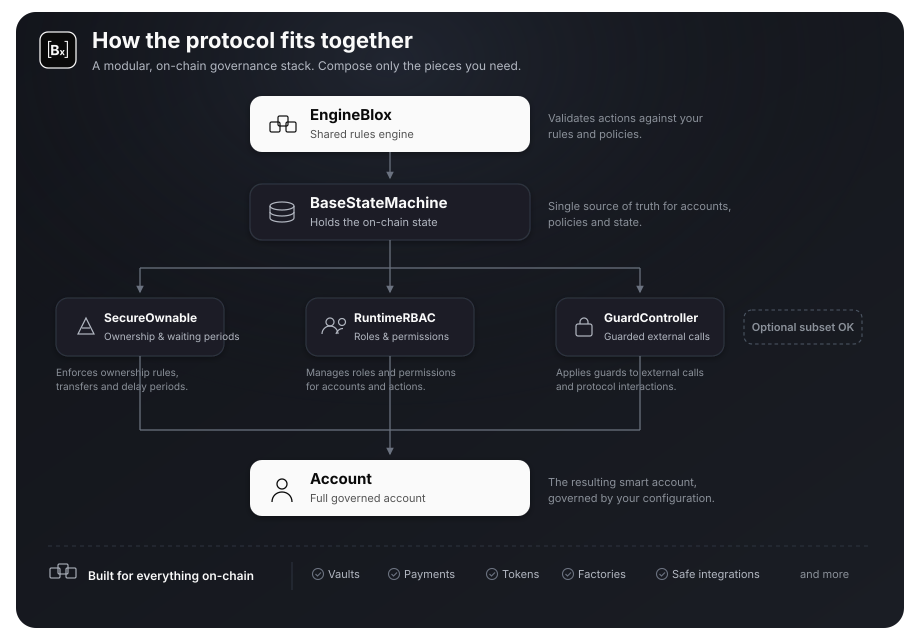
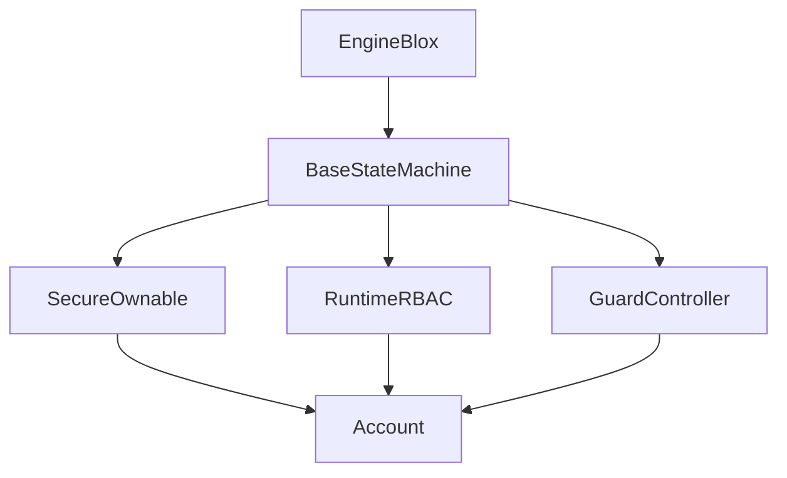

<p align="center">
  
</p>

<p align="center">
  <a href="https://opensource.org/licenses/MPL-2.0"></a>
  <a href="./audits/nethermind/Nethermind-Bloxchain-Core-NM_0828.pdf"></a>
  <a href="https://scorecard.dev/viewer/?uri=github.com/PracticalParticle/Bloxchain-Protocol"></a>
  <a href="https://www.npmjs.com/package/@bloxchain/sdk"></a>
  <a href="https://github.com/PracticalParticle/Bloxchain-Protocol/actions/workflows/particle-ci.yml"></a>
  <a href="https://docs.bloxchain.app"></a>
  <a href="#official-createx-catalog"></a>
</p>

# Bloxchain Protocol

**Open-source composable security framework for governed Ethereum applications.**

Build on-chain security and authorization rules into vaults, tokens, payments, and governed accounts.

## Why Bloxchain

Reusable on-chain authorization and operation lifecycles. Pick a path:

| I am… | Start here |
|-------|------------|
| Deploying a governed account | [Deploy a governed account](#deploy-a-governed-account) · [supported networks](#official-createx-catalog) |
| Integrating from a product (TypeScript) | [Integrate with the SDK](#integrate-with-the-sdk) · [Getting started](./docs/getting-started.md) |
| Building smart contracts (Solidity) | [What you can build](#what-you-can-build) · [`@bloxchain/contracts`](https://www.npmjs.com/package/@bloxchain/contracts) |
| Reviewing security | [Nethermind report](./audits/nethermind/) · [AUDIT.md](./contracts/core/AUDIT.md) · [Architecture](#architecture) |
| Evaluating for an organization | [docs.bloxchain.app](https://docs.bloxchain.app) · [Particle CS](https://particlecs.com/) |

The optional hosted app ([bloxchain.app](https://bloxchain.app)) uses the same on-chain rules. The open protocol does not require it.

## Architecture

EngineBlox is the shared library. BaseStateMachine owns storage. SecureOwnable, RuntimeRBAC, and GuardController are **optional siblings**. Most apps use a subset. The **Account** pattern composes all three. **BasicAccount** is the governed account integrators mint. Example applications sit below as evidence.

<p align="center">
  
</p>

**Composition (text):** EngineBlox → BaseStateMachine → optional SecureOwnable / RuntimeRBAC / GuardController → Account. Most apps use a subset. BasicFactory mints BasicAccount. Examples (vaults, payments, tokens, Safe) sit below Account as evidence.

Full diagrams: [Architecture](./docs/bloxchain-architecture.md) · [State machine](./docs/state-machine-engine.md) · [Technical overview](./TECHNICAL_OVERVIEW.md) · [Account pattern](./docs/account-pattern.md)

<details>
<summary><strong>Architecture graph (machine-readable)</strong></summary>


```mermaid
graph TB
  EB["EngineBlox"]
  BSM["BaseStateMachine"]
  SO["SecureOwnable"]
  RBAC["RuntimeRBAC"]
  GC["GuardController"]
  ACC["Account"]
  EB --> BSM
  BSM --> SO
  BSM --> RBAC
  BSM --> GC
  SO --> ACC
  RBAC --> ACC
  GC --> ACC
```

</details>

<details>
<summary><strong>Architecture guarantees (protocol engineers)</strong></summary>

The audited core (`contracts/core/`) is a **library architecture**, not a single monolithic app:

1. **Single mutation surface.** `SecureOperationState` is mutated only by **EngineBlox** (linked via `DELEGATECALL`).
2. **Distinct authorization actions.** Direct approval can enforce a delay. Meta-transaction approval separates signing from submission and does not inherit that delay. Effective separation depends on wallet-to-role assignments.
3. **Defense in depth.** Redundant gates on handler vs execution selectors, permissions, and tx status run before external calls.

</details>

## Quick start
### Deploy a governed account

Deploy a **governed account** (ownership, roles, and execution rules) on any [supported network](#official-createx-catalog). **BasicFactory** mints **BasicAccount**. The time-lock is **1 to 90 days** (default 1 day).

1. **Safest.** Use [bloxchain.app](https://bloxchain.app). Your wallet confirms the transaction. This script never sees a private key.
2. **Guided, on your machine.** From a clone of this repository:

```bash
npm run create-account
```

Pick a network by number. The chain id comes from that list. Each later question explains itself: who may submit approved operations, who may start an ownership transfer, how many days a direct approval waits, and whether the account address is new or deterministic. A deterministic address uses an index and a 32-byte salt. The same key, index, and salt land on the same address on every supported network. The script prints that address and waits for **yes** before it sends.

Put the signing key in a gitignored `.env.deployment` as `DEPLOY_PRIVATE_KEY` only. That is the recommended local method. A key typed at the prompt is visible and can be stored in shell history. The key pays the fee and becomes the owner. Use a key that holds only the fee for this deployment. `DEPLOY_RPC_URL` is optional. It is used only when it is a node for the network you picked. Otherwise the script uses a built-in public connection, or asks for a node URL.

3. **Developer, non-interactive.** `CREATE_ACCOUNT_USE_DEFAULTS=1 npm run create-account` reads `DEPLOY_PRIVATE_KEY`, `DEPLOY_RPC_URL`, and `DEPLOY_NETWORK_NAME` from `.env.deployment`. Time-lock stays in seconds (`BLOX_TIMELOCK_SECONDS`). Deterministic: add `CREATE_ACCOUNT_DETERMINISTIC=1` (`CREATE_ACCOUNT_INDEX` and `CREATE_ACCOUNT_SALT` optional).

See [Account pattern](./docs/account-pattern.md) · [shared addresses](#official-createx-catalog).

The 1-second **AccountBlox** template and **CopyBlox** stay out of the guided menu. Developers on Sepolia can set `CREATE_ACCOUNT_EXPERIMENTAL=1` (with `DEPLOY_NETWORK_NAME=sepolia` when running non-interactive). That path is outside the audited core.

### Build smart contracts

**Package consumption** (Node.js **>=18.20.5**):

```bash
npm install @bloxchain/contracts
```

**Build from this repository** (Node.js **>=22.12.0**):

```bash
git clone https://github.com/PracticalParticle/Bloxchain-Protocol.git
cd Bloxchain-Protocol
npm install
npm run compile:foundry
npm run test:foundry
```

Extend patterns under [`contracts/examples/`](./contracts/examples/). Pin exact versions in production. [VERSIONING](./docs/VERSIONING.md).

## What you can build

Compose only what you need. Account wires all three core components. Most apps use a **subset**.

| I want to build… | In plain terms | Protocol pieces | Start from |
|------------------|----------------|-----------------|------------|
| Governed smart account / treasury | Full account stack with roles and execution rules | Account (SecureOwnable + RuntimeRBAC + GuardController) | [`BasicAccount`](./contracts/account/BasicAccount.sol) · [`BasicFactory`](./contracts/factory/BasicFactory.sol) · `create-account` |
| Asset vault (ETH / ERC-20) | Vault with ownership controls | SecureOwnable | [`SimpleVault`](./contracts/examples/applications/SimpleVault/) |
| Scheduled payments | Payments with approval workflow | SecureOwnable | [`PayBlox`](./contracts/examples/applications/PayBlox/) |
| RWA / governed token | Token with on-chain governance | SecureOwnable + ERC-20 | [`SimpleRWA20`](./contracts/examples/applications/SimpleRWA20/) |
| Many copies of your own blox | Example factory that clones a blox you pass in | IBaseStateMachine | [`CopyBlox`](./contracts/examples/applications/CopyBlox/) |
| Safe + extra policy | Safe with added on-chain rules | SecureOwnable + guard | [`GuardianSafe`](./contracts/examples/integrations/Safe/GuardianSafe/) |

More: [`contracts/examples/`](./contracts/examples/) · [State abstraction vs account abstraction](./docs/state-abstraction-vs-account-abstraction.md)

## Integrate with the SDK

Pin exact versions. The catalog file ships in `@bloxchain/contracts`.

```bash
npm install @bloxchain/sdk @bloxchain/contracts viem
```

A BasicAccount clone is one address. Point `SecureOwnable`, `RuntimeRBAC`, and `GuardController` at it. There is no separate BasicAccount client. Create the viem `publicClient`, `walletClient`, and `chain` as in [Getting started](./docs/getting-started.md#2-initialize-clients).

```typescript
import official from '@bloxchain/contracts/official-deployed-addresses.json' with { type: 'json' };
import { BasicFactory, SecureOwnable, resolveOfficialNetwork, getOfficialBasicMint } from '@bloxchain/sdk';

const network = resolveOfficialNetwork(official, chainId);
const { factory: factoryAddress } = getOfficialBasicMint(network);

const factory = new BasicFactory(publicClient, walletClient, factoryAddress, chain);
const minted = await factory.cloneBlox(
  {
    initialOwner: ownerAddress,
    broadcaster: broadcasterAddress,
    recovery: recoveryAddress,
    timeLockPeriodSec: 86_400n, // 1 day; allowed range is 1 to 90 days
  },
  { from: ownerAddress }, // must equal initialOwner
);
const account = factory.cloneAddressFromReceipt(await minted.wait());

const secureOwnable = new SecureOwnable(publicClient, walletClient, account, chain);
await secureOwnable.owner();
await secureOwnable.getTimeLockPeriodSec();
```

To use an account you already deployed with [bloxchain.app](https://bloxchain.app) or `npm run create-account`, skip the mint and pass that address to `SecureOwnable`.

[Provisioning an account](./docs/getting-started.md#1-the-official-factory-basicfactory--basicaccount) (including the deterministic mint) · [Meta-transactions](./docs/meta-transactions.md) · [Examples](./docs/examples-basic.md)

## Deployments

### Official CreateX catalog

Integrators mint with **BasicFactory** → **BasicAccount**. CreateX salts and `bytecodeHash none` make the six infrastructure addresses **identical on every supported network** below. Machine-readable source (ships with `@bloxchain/contracts`): [`official-deployed-addresses.json`](./official-deployed-addresses.json) (format `bloxchain-official-addresses/2`).

Bloxchain supports **9 networks**. Each network is a mainnet, plus its testnet when that testnet is in the catalog.

### Shared catalog addresses

Same address on every network in the tables below. Explorer links use Ethereum mainnet.

| Contract | Address |
|----------|---------|
| EngineBlox | [`0xb1fde79830ee7f748022922d07b3f19042ee6526`](https://etherscan.io/address/0xb1fde79830ee7f748022922d07b3f19042ee6526) |
| SecureOwnableDefinitions | [`0xeb6ca70bb64d1f87bb708460868c9b19f6987ed6`](https://etherscan.io/address/0xeb6ca70bb64d1f87bb708460868c9b19f6987ed6) |
| RuntimeRBACDefinitions | [`0x55ff61c065025e4a521532f1366981805230f988`](https://etherscan.io/address/0x55ff61c065025e4a521532f1366981805230f988) |
| GuardControllerDefinitions | [`0x8e8f6c8a11161214fdf04c702981bcd8b78f2fe0`](https://etherscan.io/address/0x8e8f6c8a11161214fdf04c702981bcd8b78f2fe0) |
| BasicAccount | [`0x234c0a76399456832a74fb29de3c78d13c22e182`](https://etherscan.io/address/0x234c0a76399456832a74fb29de3c78d13c22e182) |
| BasicFactory | [`0x6b6e4fb86ab52728d983d1a316ad9d8b48513215`](https://etherscan.io/address/0x6b6e4fb86ab52728d983d1a316ad9d8b48513215) |

CreateX factory (called, never vendored): [`0xba5Ed099633D3B313e4D5F7bdc1305d3c28ba5Ed`](https://github.com/pcaversaccio/createx).

### Mainnets

| Network | Chain ID | Explorer |
|---------|---------:|----------|
| Ethereum | 1 | [etherscan.io](https://etherscan.io) |
| Base | 8453 | [basescan.org](https://basescan.org) |
| Optimism | 10 | [optimistic.etherscan.io](https://optimistic.etherscan.io) |
| Arbitrum One | 42161 | [arbiscan.io](https://arbiscan.io) |
| Polygon PoS | 137 | [polygonscan.com](https://polygonscan.com) |
| BNB Smart Chain | 56 | [bscscan.com](https://bscscan.com) |
| Avalanche C-Chain | 43114 | [snowtrace.io](https://snowtrace.io) |
| Arc | 5042 | [mainnet.arcscan.app](https://mainnet.arcscan.app) |
| Robinhood | 4663 | [explorer.chain.robinhood.com](https://explorer.chain.robinhood.com) |

Polygon PoS mints need a higher gas limit than the other networks. `create-account` sends that mint with a gas limit of 20,000,000. The other networks use 16,777,216.

### Testnets

| Network | Chain ID | Explorer |
|---------|---------:|----------|
| Sepolia | 11155111 | [sepolia.etherscan.io](https://sepolia.etherscan.io) |
| Base Sepolia | 84532 | [sepolia.basescan.org](https://sepolia.basescan.org) |
| Optimism Sepolia | 11155420 | [sepolia-optimism.etherscan.io](https://sepolia-optimism.etherscan.io) |
| Arbitrum Sepolia | 421614 | [sepolia.arbiscan.io](https://sepolia.arbiscan.io) |
| Arc Testnet | 5042002 | [testnet.arcscan.app](https://testnet.arcscan.app) |
| Robinhood Testnet | 46630 | [explorer.testnet.chain.robinhood.com](https://explorer.testnet.chain.robinhood.com) |

Polygon PoS, BNB Smart Chain, and Avalanche C-Chain are mainnet-only in this catalog.

### Experimental developer path (Sepolia)

**AccountBlox** and **CopyBlox** are example contracts for people experimenting on Sepolia:

- **AccountBlox.** Account-pattern template with a **1-second** time-lock floor.
- **CopyBlox.** Open factory that can clone any standard `IBaseStateMachine` blox, including AccountBlox.

**BasicAccount** uses a **1-day** floor. **BasicFactory** clones BasicAccount only. These example addresses are under `networks.sepolia.developerTools` in the JSON file. Wire them with `@bloxchain/contracts` artifacts and viem. They are **not** exported from `@bloxchain/sdk`. The guided `create-account` menu does not offer this path. Developers set `CREATE_ACCOUNT_EXPERIMENTAL=1` and select Sepolia.

| Contract | Address |
|----------|---------|
| AccountBlox (experimental) | [`0x783eb64d7d5de55f6913f9cb42ef5a4c402884c0`](https://sepolia.etherscan.io/address/0x783eb64d7d5de55f6913f9cb42ef5a4c402884c0) |
| CopyBlox (experimental) | [`0x928a2bd6c13e4f48a0850d2171a8d79b29959fc7`](https://sepolia.etherscan.io/address/0x928a2bd6c13e4f48a0850d2171a8d79b29959fc7) |

### Other networks

A private chain, or a public chain that is not in the tables above, is outside the supported catalog. You can deploy the contracts from this repository onto that chain yourself and point your integration at the addresses you deployed. A local deploy does not add that chain to the published catalog. Record the addresses in your own project.

## Security

- **Audit scope:** [`contracts/core/`](./contracts/core/) — [Nethermind NM_0828](./audits/nethermind/Nethermind-Bloxchain-Core-NM_0828.pdf) · [AUDIT.md](./contracts/core/AUDIT.md). Examples are out of scope, including the Sepolia AccountBlox template.
- **Reporting:** [SECURITY.md](./SECURITY.md) only.
- **Model notes:** Direct approval can enforce a delay. Meta-transaction approval separates signing from submission and does **not** inherit that delay. See [WHITEPAPER.md](./WHITEPAPER.md#33-direct-delay-and-meta-authorization-are-different-policies).

<details>
<summary><strong>FAQ — organizations</strong></summary>

**What is Bloxchain in one sentence?**
An open-source framework so teams run blockchain operations through auditable on-chain rules: roles, waiting periods, and controlled external calls.

**Can we deploy a governed account on mainnet?**
Yes. BasicFactory and BasicAccount each keep their own address on every one of the [9 supported networks](#official-createx-catalog), including Ethereum mainnet.

**What is bloxchain.app?**
An optional hosted app for operating governed accounts in the browser. It follows the same on-chain rules as a self-hosted integration. [docs.bloxchain.app](https://docs.bloxchain.app).

**What was audited?**
The protocol **core framework**. The example apps are a separate tree. [Nethermind NM_0828](./audits/nethermind/) · [AUDIT.md](./contracts/core/AUDIT.md).

</details>

<details>
<summary><strong>FAQ — developers</strong></summary>

**Is this only for smart accounts?**
Governed accounts are the integrator path. Vaults, tokens, and Safe integrations compose subsets of the core. See [what you can build](#what-you-can-build).

**How is this different from ERC-4337 / smart wallets?**
Operation-level governed workflows on-chain. [State abstraction vs account abstraction](./docs/state-abstraction-vs-account-abstraction.md).

**Are meta-transactions timelocked?**
The core meta-transaction approval path does not apply the direct-approval delay. Direct approval enforces `releaseTime`. Meta approval uses separately permissioned signing and submission. See the [technical paper](./WHITEPAPER.md#33-direct-delay-and-meta-authorization-are-different-policies).

**How is this different from OpenZeppelin AccessControl + Timelock?**
Unified transaction lifecycle (request, approve, sign, execute), guarded external execution, function schemas, and a single audited **EngineBlox** state machine.

**Can I contribute to `contracts/core/`?**
Particle CS maintains the audited core. Contributions to docs, the SDK, tooling, and examples are welcome. See [CONTRIBUTING.md](./CONTRIBUTING.md).

</details>

## Documentation

| Topic | Link |
|-------|------|
| Public docs | [docs.bloxchain.app](https://docs.bloxchain.app) |
| Protocol technical thesis | [WHITEPAPER.md](./WHITEPAPER.md) |
| Account pattern | [docs/account-pattern.md](./docs/account-pattern.md) |
| Getting started (SDK) | [docs/getting-started.md](./docs/getting-started.md) |
| API reference | [docs/api-reference.md](./docs/api-reference.md) |
| Core audit policy | [contracts/core/AUDIT.md](./contracts/core/AUDIT.md) |

## Development

```bash
npm run compile:foundry          # add :size for 24KB check
npm run build:artifacts          # publishable artifacts (ABI + bytecode) into artifacts/
npm run verify:package-consumption   # packed @bloxchain/contracts installs with artifacts + addresses
npm run validate:official-addresses  # schema-check the published address file
npm run provision:account -- --offline   # reference provisioner, no chain needed
npm run test:foundry
npm run test:foundry:fuzz        # 37 suites, 309 tests — see test/foundry/docs/
npm run test:e2e                 # SDK sanity on remote_evm
npm run docgen
```

See [CONTRIBUTING.md](./CONTRIBUTING.md) for the full command matrix.

## Contributing

Particle CS maintains the audited core (`contracts/core/`). Contributions to docs, the SDK, tooling, and examples are welcome. Security: [SECURITY.md](./SECURITY.md) only. DCO sign-off required (`git commit -s`). [Code of Conduct](./CODE_OF_CONDUCT.md).

## License

**MPL-2.0.** [LICENSE](./LICENSE). `contracts/examples/` use per-file licenses (typically MIT).

## Support

[GitHub Issues](https://github.com/PracticalParticle/Bloxchain-Protocol/issues) · [Discussions](https://github.com/PracticalParticle/Bloxchain-Protocol/discussions) · [Particle CS](https://particlecs.com/)

<details>
<summary><strong>Star History</strong></summary>

[](https://star-history.com/#PracticalParticle/Bloxchain-Protocol&Date)

</details>

---

Created by [Particle Crypto Security](https://particlecs.com/) · Copyright © 2026 Particle Crypto Security
