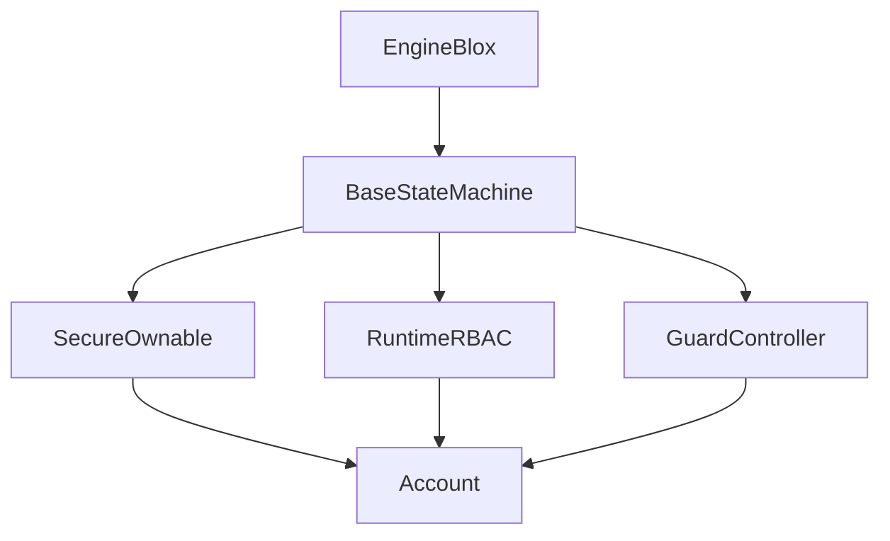

<p align="center">
  <a href="https://github.com/PracticalParticle/Bloxchain-Protocol">
    
  </a>
</p>

# Bloxchain Protocol

**Open-source composable security framework for governed Ethereum applications.**

Build on-chain security and authorization rules into vaults, tokens, payments, and governed accounts.

[](https://opensource.org/licenses/MPL-2.0) [](./audits/nethermind/Nethermind-Bloxchain-Core-NM_0828.pdf) [](https://scorecard.dev/viewer/?uri=github.com/PracticalParticle/Bloxchain-Protocol) [](https://www.npmjs.com/package/@bloxchain/sdk) [](https://github.com/PracticalParticle/Bloxchain-Protocol/actions/workflows/particle-ci.yml) [](https://docs.bloxchain.app) [](#official-createx-catalog)

**Install:** `npm install @bloxchain/sdk viem` (TypeScript) · `npm install @bloxchain/contracts` (Solidity) · [choose a path](#quick-start)

> [!IMPORTANT]
> **Audited core:** [`contracts/core/`](./contracts/core/) — [Nethermind NM_0828](./audits/nethermind/Nethermind-Bloxchain-Core-NM_0828.pdf) ([policy](./contracts/core/AUDIT.md)). Example apps under `contracts/examples/` are **out of scope**.  
> **Official deployments:** CreateX same-address catalog on the [supported networks](#official-createx-catalog) below (including Ethereum mainnet and Sepolia). Audit does not change product maturity.  
> **Security:** [SECURITY.md](./SECURITY.md) · Optional hosted Console: [bloxchain.app](https://bloxchain.app) (alpha, testnet-first) — [docs](https://docs.bloxchain.app).

## Why Bloxchain

Reusable on-chain authorization and operation lifecycles — not ad-hoc signing, and not a wallet product. Pick a path:

| I am… | Start here |
|-------|------------|
| Building smart contracts (Solidity) | [What you can build](#what-you-can-build) · [`@bloxchain/contracts`](https://www.npmjs.com/package/@bloxchain/contracts) |
| Integrating from a product (TypeScript) | [Quick start — SDK](#integrate-with-the-sdk) · [Getting started](./docs/getting-started.md) |
| Deploying a governed account (testnet) | [Deploy on Sepolia](#deploy-on-sepolia) |
| Reviewing security | [Nethermind report](./audits/nethermind/) · [AUDIT.md](./contracts/core/AUDIT.md) · [Architecture](#architecture) |
| Evaluating for an organization | [docs.bloxchain.app](https://docs.bloxchain.app) · [Particle CS](https://particlecs.com/) |

The optional hosted Console ([bloxchain.app](https://bloxchain.app)) uses the same on-chain rules — not required to use the open protocol.

## Architecture

EngineBlox is the shared library. BaseStateMachine owns storage. SecureOwnable, RuntimeRBAC, and GuardController are **optional siblings** — most apps use a subset. The **Account** pattern composes all three. Example applications sit below as evidence, not as the product.

<p align="center">
  
</p>

**Composition (text):** EngineBlox → BaseStateMachine → optional SecureOwnable / RuntimeRBAC / GuardController → Account. Most apps use a subset; examples (vaults, payments, tokens, factories, Safe) sit below Account as evidence.

Full diagrams: [Architecture](./docs/bloxchain-architecture.md) · [State machine](./docs/state-machine-engine.md) · [Technical overview](./TECHNICAL_OVERVIEW.md) · [Account pattern](./docs/account-pattern.md)

<details>
<summary><strong>Architecture graph (machine-readable)</strong></summary>


```mermaid
graph TB
  EB["EngineBlox"]
  BSM["BaseStateMachine"]
  SO["SecureOwnable"]
  RBAC["RuntimeRBAC"]
  GC["GuardController"]
  ACC["Account"]
  EB --> BSM
  BSM --> SO
  BSM --> RBAC
  BSM --> GC
  SO --> ACC
  RBAC --> ACC
  GC --> ACC
```

</details>

<details>
<summary><strong>Architecture guarantees (protocol engineers)</strong></summary>

The audited core (`contracts/core/`) is a **library architecture**, not a single monolithic app:

1. **Single mutation surface** — `SecureOperationState` mutated only by **EngineBlox** (linked via `DELEGATECALL`).
2. **Distinct authorization actions** — direct approval can enforce a delay; meta-transaction approval separates signing from submission but does not inherit that delay. Effective separation depends on wallet-to-role assignments.
3. **Defense in depth** — redundant gates on handler vs execution selectors, permissions, and tx status before external calls.

</details>

## What you can build

Compose only what you need. Account wires all three core components; most apps use a **subset**.

| I want to build… | In plain terms | Protocol pieces | Example |
|------------------|----------------|-----------------|---------|
| Governed smart account / treasury | Full account stack with roles and execution rules | Account (SecureOwnable + RuntimeRBAC + GuardController) | [`AccountBlox`](./contracts/examples/templates/AccountBlox.sol) · `create-wallet` |
| Asset vault (ETH / ERC-20) | Vault with ownership controls | SecureOwnable | [`SimpleVault`](./contracts/examples/applications/SimpleVault/) |
| Scheduled payments | Payments with approval workflow | SecureOwnable | [`PayBlox`](./contracts/examples/applications/PayBlox/) |
| RWA / governed token | Token with on-chain governance | SecureOwnable + ERC-20 | [`SimpleRWA20`](./contracts/examples/applications/SimpleRWA20/) |
| Clone factory | Many instances from one template | BaseStateMachine | [`CopyBlox`](./contracts/examples/applications/CopyBlox/) |
| Safe + extra policy | Safe with added on-chain rules | SecureOwnable + guard | [`GuardianSafe`](./contracts/examples/integrations/Safe/GuardianSafe/) |

More: [`contracts/examples/`](./contracts/examples/) · [State abstraction vs account abstraction](./docs/state-abstraction-vs-account-abstraction.md)

## Quick start

Pick one path. Node.js **>=18.20.5** for npm packages (`sdk/typescript/package.json`).

### Deploy on Sepolia

Deploy a **governed account** (full on-chain stack: ownership, roles, and execution rules):

```bash
npm run create-wallet
```

Uses **AccountBlox** after foundation is deployed. See [Account pattern](./docs/account-pattern.md) · [Sepolia addresses](#sepolia--deployed-addresses).

### Integrate with the SDK

```bash
npm install @bloxchain/sdk viem
```

```typescript
import { SecureOwnable } from '@bloxchain/sdk';

// Placeholders — create publicClient / walletClient / chain and addresses per docs/getting-started.md
const secureOwnable = new SecureOwnable(publicClient, walletClient, contractAddress, chain);

// Request must come from RECOVERY_ROLE (new owner is snapshotted from getRecovery() at request time)
const request = await secureOwnable.transferOwnershipRequest({ from: recoveryAddress });
await request.wait();

const pending = await secureOwnable.getPendingTransactions();
const txId = pending[pending.length - 1];
const record = await secureOwnable.getTransaction(txId);

// Direct delayed approval requires chain time >= record.releaseTime — run this call later (or poll) after the timelock
await secureOwnable.transferOwnershipDelayedApproval(txId, { from: ownerAddress });
```

Sign in browser; optional relay per environment — [meta-transactions](./docs/meta-transactions.md) · [examples](./docs/examples-basic.md) · [getting started](./docs/getting-started.md).

### Build smart contracts

**Package consumption** (Node.js **>=18.20.5**):

```bash
npm install @bloxchain/contracts
```

**Build from this monorepo** (Node.js **>=22.12.0**):

```bash
git clone https://github.com/PracticalParticle/Bloxchain-Protocol.git
cd Bloxchain-Protocol
npm install
npm run compile:foundry
npm run test:foundry
```

Extend patterns under [`contracts/examples/`](./contracts/examples/). Pin exact versions in production — [VERSIONING](./docs/VERSIONING.md).

## Security

- **Audit scope:** [`contracts/core/`](./contracts/core/) — [Nethermind NM_0828](./audits/nethermind/Nethermind-Bloxchain-Core-NM_0828.pdf) · [AUDIT.md](./contracts/core/AUDIT.md). Examples are out of scope.
- **Reporting:** [SECURITY.md](./SECURITY.md) only.
- **Model notes:** Direct approval can enforce a delay; meta-transaction approval separates signing from submission and does **not** inherit that delay. See [WHITEPAPER.md](./WHITEPAPER.md#33-direct-delay-and-meta-authorization-are-different-policies).

<details>
<summary><strong>FAQ — organizations</strong></summary>

**What is Bloxchain in one sentence?**  
An open-source framework so teams run blockchain operations through auditable on-chain rules — roles, waiting periods, and controlled external calls — instead of ad-hoc signing.

**Can we use this on mainnet today?**  
Yes — the official CreateX catalog is declared on Ethereum mainnet and the other [supported networks](#official-createx-catalog). Product surfaces remain alpha / testnet-first; completing an audit does not change that posture.

**What is bloxchain.app?**  
An optional hosted Console to operate governed accounts in the browser (alpha, testnet-first). Same on-chain rules as self-hosted integrations — [docs.bloxchain.app](https://docs.bloxchain.app).

**What was audited?**  
The Protocol **core framework** (not every example app). [Nethermind NM_0828](./audits/nethermind/) · [AUDIT.md](./contracts/core/AUDIT.md).

</details>

<details>
<summary><strong>FAQ — developers</strong></summary>

**Is this only for smart accounts?**  
No. See [what you can build](#what-you-can-build) — vaults, tokens, factories, and Safe integrations compose subsets of the core.

**How is this different from ERC-4337 / smart wallets?**  
Operation-level governed workflows on-chain — not wallet UX or bundler infrastructure. [State abstraction vs account abstraction](./docs/state-abstraction-vs-account-abstraction.md).

**Are meta-transactions timelocked?**  
Not by the core meta-transaction approval path. Direct approval enforces `releaseTime`; meta approval uses separately permissioned signing and submission. See the [technical paper](./WHITEPAPER.md#33-direct-delay-and-meta-authorization-are-different-policies).

**How is this different from OpenZeppelin AccessControl + Timelock?**  
Unified transaction lifecycle (request → approve, sign → execute), guarded external execution, function schemas, and a single audited **EngineBlox** state machine.

**Can I contribute to `contracts/core/`?**  
No public PRs — audited core is maintained by Particle CS. See [CONTRIBUTING.md](./CONTRIBUTING.md) for docs, SDK, tooling, and examples.

</details>

## Deployments

<details id="official-createx-catalog" open>
<summary><strong>Official CreateX catalog (shared addresses)</strong></summary>

The official Platform mint is **`BasicFactory` → `BasicAccount`**. CreateX salts and
`bytecodeHash none` make the six infrastructure addresses **identical on every supported
network** below. Machine-readable SoT (ships with `@bloxchain/contracts`):
**[`official-deployed-addresses.json`](./official-deployed-addresses.json)** (format
`bloxchain-official-addresses/2`).

```typescript
import official from '@bloxchain/contracts/official-deployed-addresses.json' with { type: 'json' };
import { resolveOfficialNetwork, getOfficialBasicMint } from '@bloxchain/sdk';

const network = resolveOfficialNetwork(official, chainId); // e.g. 1 or 11155111
const { factory, implementation } = getOfficialBasicMint(network);
```

### Shared catalog addresses

Same on every network in the table that follows. Explorer links use Sepolia as a
readable example; substitute the network explorer from the supported-networks list.

| Contract | Address |
|----------|---------|
| EngineBlox | [`0xb1fde79830ee7f748022922d07b3f19042ee6526`](https://sepolia.etherscan.io/address/0xb1fde79830ee7f748022922d07b3f19042ee6526) |
| SecureOwnableDefinitions | [`0xeb6ca70bb64d1f87bb708460868c9b19f6987ed6`](https://sepolia.etherscan.io/address/0xeb6ca70bb64d1f87bb708460868c9b19f6987ed6) |
| RuntimeRBACDefinitions | [`0x55ff61c065025e4a521532f1366981805230f988`](https://sepolia.etherscan.io/address/0x55ff61c065025e4a521532f1366981805230f988) |
| GuardControllerDefinitions | [`0x8e8f6c8a11161214fdf04c702981bcd8b78f2fe0`](https://sepolia.etherscan.io/address/0x8e8f6c8a11161214fdf04c702981bcd8b78f2fe0) |
| BasicAccount | [`0x234c0a76399456832a74fb29de3c78d13c22e182`](https://sepolia.etherscan.io/address/0x234c0a76399456832a74fb29de3c78d13c22e182) |
| BasicFactory | [`0x6b6e4fb86ab52728d983d1a316ad9d8b48513215`](https://sepolia.etherscan.io/address/0x6b6e4fb86ab52728d983d1a316ad9d8b48513215) |

CreateX factory (called, never vendored): [`0xba5Ed099633D3B313e4D5F7bdc1305d3c28ba5Ed`](https://github.com/pcaversaccio/createx).

### Supported networks

| Network | Chain ID | Explorer |
|---------|---------:|----------|
| Ethereum | 1 | [etherscan.io](https://etherscan.io) |
| Sepolia | 11155111 | [sepolia.etherscan.io](https://sepolia.etherscan.io) |
| Base | 8453 | [basescan.org](https://basescan.org) |
| Base Sepolia | 84532 | [sepolia.basescan.org](https://sepolia.basescan.org) |
| Optimism | 10 | [optimistic.etherscan.io](https://optimistic.etherscan.io) |
| Optimism Sepolia | 11155420 | [sepolia-optimism.etherscan.io](https://sepolia-optimism.etherscan.io) |
| Arbitrum One | 42161 | [arbiscan.io](https://arbiscan.io) |
| Arbitrum Sepolia | 421614 | [sepolia.arbiscan.io](https://sepolia.arbiscan.io) |
| Polygon PoS | 137 | [polygonscan.com](https://polygonscan.com) |
| BNB Smart Chain | 56 | [bscscan.com](https://bscscan.com) |
| Avalanche C-Chain | 43114 | [snowtrace.io](https://snowtrace.io) |
| Arc | 5042 | [mainnet.arcscan.app](https://mainnet.arcscan.app) |
| Arc Testnet | 5042002 | [testnet.arcscan.app](https://testnet.arcscan.app) |
| Robinhood | 4663 | [explorer.chain.robinhood.com](https://explorer.chain.robinhood.com) |
| Robinhood Testnet | 46630 | [explorer.testnet.chain.robinhood.com](https://explorer.testnet.chain.robinhood.com) |

Not yet in this catalog (faucet-deferred): Polygon Amoy, Avalanche Fuji, BNB Testnet.
Tron / TVM is out of scope for CreateX same-address.

### Official developer toolkit (Sepolia)

**AccountBlox** / **CopyBlox** are an official developer experiment path on Sepolia — same
product family, different job from the Platform CreateX mint:

- **AccountBlox** — Account-pattern template with a **1-second** time-lock floor (fast loops). Platform `BasicAccount` uses a **1-day** floor.
- **CopyBlox** — open factory that can clone any standard `IBaseStateMachine` blox, not only AccountBlox. Platform `BasicFactory` is pinned to BasicAccount only.

Addresses live under `networks.sepolia.developerTools` in the JSON file. Wire them with
`@bloxchain/contracts` artifacts and viem — they are **not** exported from `@bloxchain/sdk`.

| Contract | Address |
|----------|---------|
| AccountBlox (developer) | [`0x783eb64d7d5de55f6913f9cb42ef5a4c402884c0`](https://sepolia.etherscan.io/address/0x783eb64d7d5de55f6913f9cb42ef5a4c402884c0) |
| CopyBlox (developer) | [`0x928a2bd6c13e4f48a0850d2171a8d79b29959fc7`](https://sepolia.etherscan.io/address/0x928a2bd6c13e4f48a0850d2171a8d79b29959fc7) |

### Lab / undeclared deploys

Addresses written by deploy scripts go to **`deployed-addresses.json`** (git-ignored, any
network including lab, never published). Promote into the official file only with an
explicit human `--declare`:

```bash
npm run promote:official-addresses -- --network <name> --chain-id <id>
npm run promote:official-addresses -- --network <name> --chain-id <id> --declare
npm run validate:official-addresses -- --require-official <name>
```

The promoter refuses a network whose CreateX addresses differ from the shared catalog.

<details id="sepolia--deployed-addresses">
<summary><strong>Try on Sepolia (create-wallet)</strong></summary>

```bash
npm run create-wallet
```

Interactive: choose network, set owner / broadcaster / recovery and time-lock. Uses
`.env.deployment` and prints the clone address.

Non-interactive developer-toolkit path: `CREATE_WALLET_USE_DEFAULTS=1 node scripts/deployment/create-wallet-copyblox.js`

</details>

</details>

<details>
<summary><strong>Development &amp; testing</strong></summary>

```bash
npm run compile:foundry          # add :size for 24KB check
npm run build:artifacts          # publishable artifacts (ABI + bytecode) into artifacts/
npm run verify:package-consumption   # packed @bloxchain/contracts installs with artifacts + addresses
npm run validate:official-addresses  # schema-check the published address file
npm run provision:account -- --offline   # reference provisioner, no chain needed
npm run test:foundry
npm run test:foundry:fuzz        # 37 suites, 309 tests — see test/foundry/docs/
npm run test:e2e                 # SDK sanity on remote_evm
npm run docgen
```

See [CONTRIBUTING.md](./CONTRIBUTING.md) for the full command matrix.

</details>

## Documentation

| Topic | Link |
|-------|------|
| Public docs (Platform + SDK + Protocol) | [docs.bloxchain.app](https://docs.bloxchain.app) |
| Protocol technical thesis | [WHITEPAPER.md](./WHITEPAPER.md) |
| Account pattern | [docs/account-pattern.md](./docs/account-pattern.md) |
| Getting started (SDK) | [docs/getting-started.md](./docs/getting-started.md) |
| API reference | [docs/api-reference.md](./docs/api-reference.md) |
| Core audit policy | [contracts/core/AUDIT.md](./contracts/core/AUDIT.md) |

## Contributing

Selective contributions welcome (docs, SDK aligned with core, tooling, examples) — **not** public PRs to **`contracts/core/`** (audited; Particle CS only). Security: [SECURITY.md](./SECURITY.md) only. DCO sign-off required (`git commit -s`). [Code of Conduct](./CODE_OF_CONDUCT.md).

## License

**MPL-2.0** — [LICENSE](./LICENSE). **`contracts/examples/`** use per-file licenses (typically MIT).

## Support

[GitHub Issues](https://github.com/PracticalParticle/Bloxchain-Protocol/issues) · [Discussions](https://github.com/PracticalParticle/Bloxchain-Protocol/discussions) · [Particle CS](https://particlecs.com/)

<details>
<summary><strong>Star History</strong></summary>

[](https://star-history.com/#PracticalParticle/Bloxchain-Protocol&Date)

</details>

---

Created by [Particle Crypto Security](https://particlecs.com/) · Copyright © 2026 Particle Crypto Security
