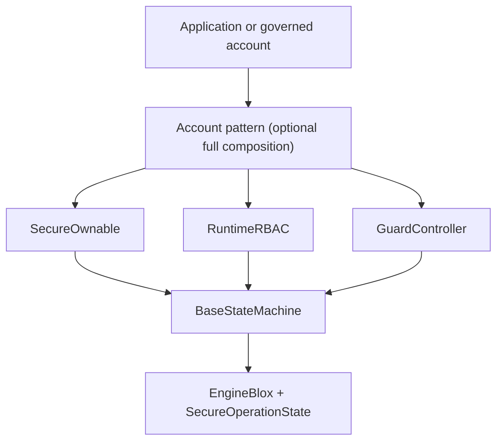
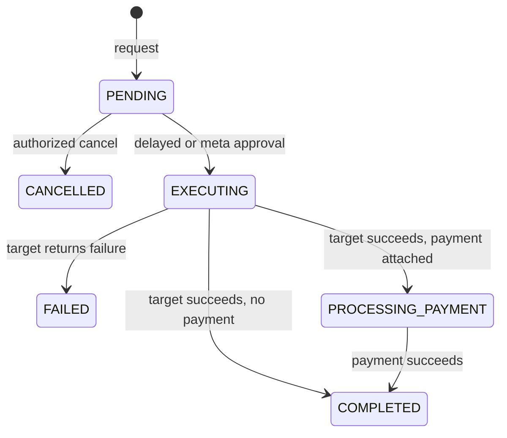
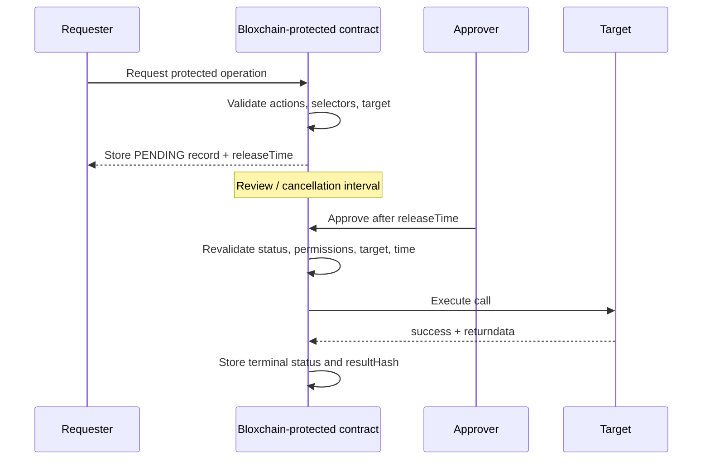

# Bloxchain Protocol

## State Abstraction for Secure On-Chain Operations

**Particle Crypto Security**
**Technical paper · August 2026**

Licensed under the [Mozilla Public License 2.0](./LICENSE).

---

## Abstract

Possession of a valid signing key answers one question: *who authorized this message?* It does
not, by itself, define whether an operation should execute immediately, which other authority
must participate, which targets may be called, or how the operation should be observed and
cancelled.

Bloxchain Protocol addresses that gap with **state abstraction**: application operations are
represented as explicit on-chain records and processed through a shared state machine. The
protocol combines role- and action-level authorization, direct time-delayed execution,
EIP-712 meta-transactions, target restrictions, lifecycle events, and composable core
components. Integrators can adopt one component or compose the full `Account` pattern.

This paper explains the protocol's technical thesis, implemented architecture, trust model,
and security boundaries. Solidity under [`contracts/core/`](./contracts/core/) is the
authoritative implementation. The detailed guides under [`docs/`](./docs/) remain the
authoritative integration documentation.

> **Implementation status**
>
> - The core protocol has been independently audited by Nethermind under engagement
>   [NM_0828](./audits/nethermind/README.md).
> - The published audit scope is Solidity under [`contracts/core/`](./contracts/core/).
>   Examples, the TypeScript SDK, integrator contracts, proxies, and specific deployments
>   are outside that scope.
> - Official deployments are available on **Ethereum Sepolia** today. Official Ethereum
>   mainnet deployments are **coming soon**.

---

## 1. The authorization gap

Most Ethereum applications begin with a direct execution pattern:

```text
signer → contract function → immediate state change
```

The EVM verifies the transaction sender and executes the selected function atomically. Any
additional controls—multiple authorities, a review period, cancellation, target restrictions,
or delegated execution—must be designed into the application.

That creates three recurring engineering problems.

### 1.1 Identity is not workflow

A signature establishes control of a key. It does not encode an application's complete
authorization policy. A sensitive operation may require a requester and a separate executor,
a delay before execution, or permission for both a public handler and the function that handler
will invoke.

### 1.2 Immediate execution removes the intervention window

When authorization and execution occur in the same call, monitoring can report an incident only
after the state change. A delayed path can instead expose a pending record before execution and
allow an authorized cancellation during that interval.

### 1.3 Security composition is easy to make inconsistent

Roles, timelocks, meta-transaction verification, whitelists, and event logging are often
implemented independently. A wrapper may validate one selector while executing another, a
signature may be replayable through a sibling entrypoint, or a target may be checked when a
request is created but not when it executes.

Bloxchain centralizes these concerns around one operation record and one set of lifecycle
rules.

---

## 2. State abstraction

In Bloxchain, **state abstraction** means representing application-level state transitions as
authorized operations with explicit lifecycle, policy, and evidence.

It is an operation-layer pattern:

```text
intent
  → authorization
  → pending operation record
  → policy gate
  → execution
  → terminal state and result commitment
```

The application still executes ordinary EVM calls. The abstraction is the policy-bearing
operation that mediates those calls.

### 2.1 Relationship to account abstraction

State abstraction and account abstraction solve different problems and can be used together.

| | Account abstraction | Bloxchain state abstraction |
|---|---|---|
| Primary concern | Account validation and transaction UX | Application operation policy |
| Unit of control | User operation / smart account | `TxRecord` and protected function |
| Typical mechanisms | Bundlers, paymasters, account validation | Roles, action permissions, delays, meta-transactions, target restrictions |
| Execution question | How can this account authorize a transaction? | Under what workflow may this application operation execute? |

[ERC-4337](https://eips.ethereum.org/EIPS/eip-4337) can improve how users submit operations.
Bloxchain defines how protected operations move through application state. Neither mechanism
automatically supplies the guarantees of the other.

### 2.2 Atomicity is preserved

"Multi-phase" does not mean partial execution inside one EVM transaction. Each phase is an
ordinary atomic transaction. The protocol decomposes a higher-level operation across multiple
transactions:

1. a request creates a pending record;
2. an authorized direct or meta-transaction path approves it;
3. execution reaches a terminal state within the approving transaction.

If attached payment processing reverts, the approval transaction rolls back atomically.

---

## 3. Trust model and security boundaries

Bloxchain reduces dependence on any one direct call path, but it does not make key management,
role assignment, deployment, or integration risk disappear.

The protocol's properties assume:

- the deployed bytecode corresponds to the reviewed implementation;
- initialization is performed correctly and cannot be captured by an unintended caller;
- operators assign roles and function permissions according to the intended separation of duty;
- cryptographic primitives, EIP-712 signing software, and the underlying chain behave as assumed;
- authorized parties protect their keys and review the exact operation they sign or execute;
- application-specific targets and hooks are independently reviewed;
- monitoring systems use canonical on-chain events rather than assuming optional forwarding
  always succeeds.

The protocol does **not** guarantee safety if every required authority is compromised, if an
operator deliberately grants conflicting effective permissions through separate roles, if a
trusted target is malicious, or if an integration bypasses the protected entrypoints.

### 3.1 Enforced properties

For operations routed through the core state machine, the implementation enforces:

- **Lifecycle validity** — entrypoints require the expected `TxStatus`.
- **Action-level authorization** — permissions distinguish direct request, approve, cancel,
  meta-sign, and meta-execute actions.
- **Dual-selector authorization** — protected wrapper paths validate both the handler selector
  and the execution selector; strict schemas can also enforce their relationship.
- **Target policy** — execution targets are checked against per-function whitelists when a
  request is created and again immediately before approval executes it.
- **Meta-transaction binding** — signed payloads bind the handler contract, handler selector,
  action, chain, signer, nonce, deadline, and maximum gas price.
- **Replay protection** — signer nonces are incremented after signature verification and before
  the external execution call.
- **Checks-effects-interactions ordering** — the transaction enters `EXECUTING` before the
  target call.
- **Result commitment** — terminal execution stores a hash of return data and emits the full
  return data for off-chain verification.
- **Bounded dimensions** — immutable limits cap roles, registered functions, hooks per selector,
  and batch size.

### 3.2 Separation of duty

The permission model contains distinct sign and execute actions. A single
`FunctionPermission` cannot combine meta-sign and meta-execute bits; registration reverts with
`ConflictingMetaTxPermissions`. Component-level flows can add narrower checks—for example,
`SecureOwnable` requires its owner as signer and broadcaster as submitter for protected meta
flows.

This is a configuration primitive, not a universal claim that two unrelated people always
participate. Effective separation still depends on wallet-to-role assignments and on which
component entrypoint is used. Integrators must review the union of permissions held by each
wallet.

### 3.3 Direct delay and meta authorization are different policies

The direct approval path enforces `releaseTime`. The meta-transaction approval path
intentionally does **not** enforce the timelock: an authorized signer supplies an EIP-712
authorization and a separately authorized caller submits it.

These are parallel policy modes:

- **Direct delayed mode** provides a temporal review and cancellation window.
- **Meta-transaction mode** provides delegated, cryptographically bound authorization and can
  execute before the pending record's release time.

A deployment must not describe meta-transaction approval as timelocked unless an additional
application rule actually enforces that condition.

---

## 4. Protocol architecture

The core is organized into four layers.



### 4.1 `EngineBlox`

[`EngineBlox.sol`](./contracts/core/lib/EngineBlox.sol) is the state-machine library. It defines:

- operation records and lifecycle statuses;
- role, function-schema, and action-permission storage;
- request, delayed approval, meta approval, cancellation, and completion logic;
- EIP-712 hashing and signature verification;
- target whitelist and hook registries;
- lifecycle logging and optional event forwarding.

The library operates on one `SecureOperationState` storage instance:

```solidity
struct SecureOperationState {
    bool initialized;
    uint256 txCounter;
    uint256 timeLockPeriodSec;

    mapping(uint256 => TxRecord) txRecords;
    EnumerableSet.UintSet pendingTransactionsSet;

    mapping(bytes32 => Role) roles;
    EnumerableSet.Bytes32Set supportedRolesSet;
    mapping(address => EnumerableSet.Bytes32Set) walletRoles;

    mapping(bytes4 => FunctionSchema) functions;
    EnumerableSet.Bytes32Set supportedFunctionsSet;
    EnumerableSet.Bytes32Set supportedOperationTypesSet;

    mapping(address => uint256) signerNonces;
    address eventForwarder;

    mapping(bytes4 => EnumerableSet.AddressSet) functionTargetWhitelist;
    mapping(bytes4 => EnumerableSet.AddressSet) functionTargetHooks;
    EnumerableSet.Bytes32Set systemMacroSelectorsSet;
}
```

This shared storage model gives the components one permission graph and one operation ledger. It
does not imply that all application state belongs inside `SecureOperationState`; application
contracts retain their own domain state.

### 4.2 `BaseStateMachine`

[`BaseStateMachine.sol`](./contracts/core/base/BaseStateMachine.sol) owns `_secureState` and
exposes the common contract surface around `EngineBlox`: initialization, queries, interface
support, event handling, and internal helpers used by higher-level components.

### 4.3 Core components

Each component extends `BaseStateMachine` and loads definitions for its protected functions.

- [`SecureOwnable`](./contracts/core/security/SecureOwnable.sol) manages owner, broadcaster,
  recovery, timelock configuration, and protected ownership workflows.
- [`RuntimeRBAC`](./contracts/core/access/RuntimeRBAC.sol) manages non-protected runtime roles,
  wallet assignments, and per-function action permissions through bounded batch operations.
- [`GuardController`](./contracts/core/execution/GuardController.sol) mediates guarded calls,
  direct delayed execution, meta-transaction execution, target policy, and attached payments.

Definition libraries register function schemas, operation types, supported actions, and default
permissions. They are part of the security wiring, not merely ABI metadata.

### 4.4 `Account` pattern

[`Account.sol`](./contracts/core/pattern/Account.sol) composes all three components behind one
address and one initializer:

```solidity
abstract contract Account is GuardController, RuntimeRBAC, SecureOwnable
```

The pattern is optional. An application may inherit only the components it needs. The full
composition is appropriate when one address must combine protected ownership, runtime roles,
and guarded execution.

---

## 5. Operation lifecycle

The canonical status enum is:

```solidity
enum TxStatus {
    UNDEFINED,
    PENDING,
    EXECUTING,
    PROCESSING_PAYMENT,
    CANCELLED,
    COMPLETED,
    FAILED
}
```

There is no separate `APPROVED` or `EXECUTED` status.



### 5.1 `TxRecord`

Each operation is represented by a stored `TxRecord`:

```solidity
struct TxRecord {
    uint256 txId;
    uint256 releaseTime;
    TxStatus status;
    TxParams params;
    bytes32 message;
    bytes32 resultHash;
    PaymentDetails payment;
}
```

`TxParams` binds the requester, target, native value, gas limit, operation type, execution
selector, and encoded execution parameters. The record is therefore the shared object checked
by request, approval, cancellation, execution, and observation paths.

### 5.2 Creation

`txRequest` validates the requester's permissions for both the external handler and intended
execution selector. `_txRequest` then checks target policy, creates the record as `PENDING`,
sets `releaseTime`, stores it, adds it to the pending set, and emits the lifecycle event.

### 5.3 Approval and execution

Both approval modes require a pending record and re-check the current target policy before the
external call. The status becomes `EXECUTING` before interaction. The engine records
`COMPLETED` or `FAILED` from the call result; an attached payment introduces the intermediate
`PROCESSING_PAYMENT` state.

### 5.4 Cancellation

An authorized direct or meta-transaction cancellation can move a pending operation to
`CANCELLED`. Cancellation does not execute the target.

---

## 6. Direct delayed workflow

The delayed path separates request from approval in time.



The security value of this mode depends on operational use of the delay: pending operations
must be monitored, cancellation authority must remain available, and the delay must be long
enough for the intended response process.

The engine does not require requester and approver to be different addresses in every direct
flow. Components and deployment configuration determine which roles may perform each action.

---

## 7. EIP-712 meta-transaction workflow

Meta-transactions separate **authorization** from **submission**. An authorized signer approves
a typed payload off-chain; an authorized executor submits it on-chain.

```mermaid
sequenceDiagram
    participant S as Authorized signer
    participant E as Authorized executor
    participant P as Bloxchain-protected contract
    participant T as Target

    S->>S: Sign EIP-712 payload
    S-->>E: MetaTransaction + signature
    E->>P: Submit meta approval
    P->>P: Validate executor actions and payload binding
    P->>P: Recover signer and verify nonce/deadline/chain
    P->>P: Increment signer nonce; set EXECUTING
    P->>T: Execute call
    T-->>P: success + returndata
    P->>P: Store terminal status and resultHash
```

`MetaTxParams` binds:

- `chainId`;
- signer `nonce`;
- `handlerContract`;
- `handlerSelector`;
- requested `TxAction`;
- `deadline`;
- `maxGasPrice`;
- `signer`.

The signed operation also commits to the transaction parameters and any attached payment. The
handler contract and selector binding prevents a signature intended for one wrapper from being
replayed through a sibling entrypoint.

### 7.1 Approval of an existing request

`txApprovalWithMetaTx` approves an existing pending record. The submitted record and payment
must match storage before execution.

### 7.2 Request and approve

`requestAndApprove` creates and executes an operation in one on-chain transaction using a
pre-authorized meta-transaction. This path is useful where signer and executor separation is
the policy and a temporal delay is not required.

### 7.3 Signing safety

The protocol uses an EIP-712 digest. Wallet and backend implementations must reproduce the same
domain and type definitions. Applying an additional `personal_sign` prefix to the digest
produces a different recovered signer and fails verification.

See [Meta-Transactions](./docs/meta-transactions.md) for canonical SDK construction and signing
guidance.

---

## 8. Function schemas, permissions, and target policy

Bloxchain authorization is not a single `onlyRole` check. It joins three dimensions.

### 8.1 Function schemas

A `FunctionSchema` registers:

- the function selector and operation type;
- supported actions;
- whether handler relationships are enforced;
- whether the schema is protected;
- whether grants are revocable;
- the selectors it may handle.

Strict handler relationships prevent a wrapper permission from silently becoming authority over
an unrelated execution selector. Flexible schemas intentionally permit looser wiring and must
be used with corresponding review.

### 8.2 Role permissions

Roles are flat, not hierarchical. A wallet may hold multiple roles, and authorization succeeds
when the union of those roles grants the requested action for the selector. Protected system
roles—owner, broadcaster, and recovery—are managed by `SecureOwnable`; `RuntimeRBAC` manages
non-protected roles.

This union model is powerful but makes effective-permission review important. Auditors and
operators should reason about wallets, not just individual role definitions.

### 8.3 Target whitelists

Guarded execution uses per-function target whitelists. Membership checks occur at request time
and immediately before approval executes the call. Removing a target can therefore block a
previously requested operation from executing.

Cancellation deliberately does not require the target to remain whitelisted; an operation must
remain cancellable after target policy changes.

### 8.4 Hooks and event forwarding

The core stores a bounded per-selector hook registry, but `EngineBlox` does not automatically
call every registered hook during execution. `BaseStateMachine` instead exposes an empty
`_postActionHook` extension point, and extensions may define how registered hooks are invoked.
Any such extension becomes part of that deployment's trust and gas model.

The optional event forwarder is different: `logTxEvent` emits the canonical local event first,
then calls the configured forwarder inside `try/catch`. Forwarder failure does not revert the
core state transition solely because forwarding failed. Consumers must treat local
`TransactionEvent` logs as authoritative.

---

## 9. Audit trail and observability

The state machine emits:

```solidity
event TransactionEvent(
    uint256 indexed txId,
    bytes4 indexed functionHash,
    TxStatus status,
    address indexed requester,
    address target,
    bytes32 operationType,
    bytes32 resultHash
);

event TxExecutionResult(uint256 indexed txId, bytes result);
```

For terminal executions:

- empty return data corresponds to `resultHash == bytes32(0)`;
- non-empty return data corresponds to `keccak256(result) == resultHash`.

This allows an indexer to verify emitted return data against the commitment stored in the
transaction record. Component configuration changes are additionally exposed through
`ComponentEvent`.

The protocol does not promise unlimited on-chain query scalability. Several view helpers
materialize complete enumerable sets, so RPC cost and response size grow with stored roles,
functions, pending records, or wallets. Large deployments should index events and design
pagination at the application layer.

---

## 10. Composition and integration

The protocol supports three adoption levels.

### 10.1 Component composition

Applications can inherit `SecureOwnable`, `RuntimeRBAC`, or `GuardController` independently.
This minimizes unused surface area and lets the application define its own domain behavior.

### 10.2 Full account composition

Applications that need ownership controls, runtime permissions, and guarded execution can
inherit `Account`. Concrete account implementations then add application-specific functions
without duplicating state-machine initialization or interface composition.

### 10.3 TypeScript integration

[`@bloxchain/sdk`](https://www.npmjs.com/package/@bloxchain/sdk) provides Viem-based wrappers,
types, EIP-712 helpers, and event utilities aligned with tagged Protocol releases. The SDK is an
integration layer over the Solidity core; it does not replace on-chain authorization.

Production consumers should pin package versions and confirm that the SDK version, ABI, deployed
bytecode, and intended Protocol release agree. See [Versioning](./docs/VERSIONING.md).

---

## 11. Security limitations and deployment obligations

Architecture narrows risk; it does not remove the need for application review.

### 11.1 Initialization and upgradeability

Core contracts use upgradeable patterns and initializers. Deployments should initialize a proxy
or clone in the same transaction that creates it where possible. Upgrade authorization and
storage compatibility remain deployment responsibilities.

### 11.2 External calls

`GuardController` can call application-selected targets. Whitelisting constrains *which* target
may be called; it does not prove that target is correct, immutable, or non-malicious. Target
upgrades can change the behavior behind a previously approved address.

### 11.3 Key and role compromise

A delay helps only if monitors detect a problem and an authorized party can cancel before
release. Meta-transaction separation helps only if signer and executor authority are assigned to
independently controlled wallets. Compromise of all effective authorities defeats those controls.

### 11.4 Configuration risk

Runtime configuration is deliberately flexible. Incorrect action bitmaps, handler relationships,
whitelists, role membership, revocability, or timelock duration can weaken the intended policy
without changing core code.

### 11.5 Gas and denial of service

Bounded collections limit some growth, but configuration size, target behavior, hooks, event
forwarders, and RPC enumeration still affect gas and availability. Operators must test realistic
worst cases for their deployment.

### 11.6 Audit inheritance

Using audited core code does not make an integration audited. Changes after the audited commit,
custom inheritance, initialization, proxy administration, targets, hooks, SDK usage, and deployed
bytecode require their own assurance.

---

## 12. Implementation and audit status

### 12.1 Source of truth

The implementation hierarchy is:

1. Solidity and NatSpec under [`contracts/core/`](./contracts/core/);
2. generated and maintained technical documentation under [`docs/`](./docs/);
3. TypeScript wrappers under [`sdk/typescript/`](./sdk/typescript/);
4. this paper as the architectural narrative.

If this paper conflicts with the Solidity implementation, the Solidity implementation governs.

### 12.2 Independent audit

Nethermind engagement NM_0828 covers the core Solidity scope identified in the
[audit engagement page](./audits/nethermind/README.md). The repository's
[core audit policy](./contracts/core/AUDIT.md) records the scope and exclusions.

The audit does not cover:

- examples under `contracts/examples/`;
- community, component, or standards trees unless a later report says otherwise;
- the TypeScript SDK;
- integrator contracts or proxy configuration;
- all bytecode deployed under the Bloxchain name;
- changes made after the audited commit without an audit addendum.

### 12.3 Network status

Official Bloxchain Protocol deployments are available on Ethereum Sepolia. Official Ethereum
mainnet deployments are coming soon. Integrators can deploy the open-source contracts
independently, but those deployments are not automatically official or covered by the published
audit.

---

## 13. Technical references

- [Protocol README](./README.md)
- [Technical overview](./TECHNICAL_OVERVIEW.md)
- [Core contract graph](./docs/core-contract-graph.md)
- [State machine engine](./docs/state-machine-engine.md)
- [Meta-transactions](./docs/meta-transactions.md)
- [SecureOwnable](./docs/secure-ownable.md)
- [RuntimeRBAC](./docs/runtime-rbac.md)
- [GuardController](./docs/guard-controller.md)
- [Account pattern](./docs/account-pattern.md)
- [State abstraction and account abstraction](./docs/state-abstraction-vs-account-abstraction.md)
- [API reference](./docs/api-reference.md)
- [Security policy](./SECURITY.md)
- [Nethermind audit](./audits/nethermind/README.md)
- [EIP-712](https://eips.ethereum.org/EIPS/eip-712)
- [ERC-4337](https://eips.ethereum.org/EIPS/eip-4337)

---

## Conclusion

Bloxchain Protocol treats sensitive application operations as policy-bearing state transitions
rather than direct calls gated only by a signer. A shared operation record connects
authorization, lifecycle, target policy, execution, and evidence across composable contracts.

The central engineering distinction is explicit: direct approval provides a time-delayed path;
meta-transaction approval provides cryptographically bound, delegated authorization without
inheriting that delay. Function schemas and action permissions define which policy applies, while
the `EngineBlox` state machine enforces the resulting lifecycle.

This design provides reusable controls for secure Ethereum applications without claiming that a
framework can replace correct configuration, independent key custody, target review, deployment
discipline, monitoring, or application-specific audits.

Security reports: **security@particlecs.com** · [SECURITY.md](./SECURITY.md)
