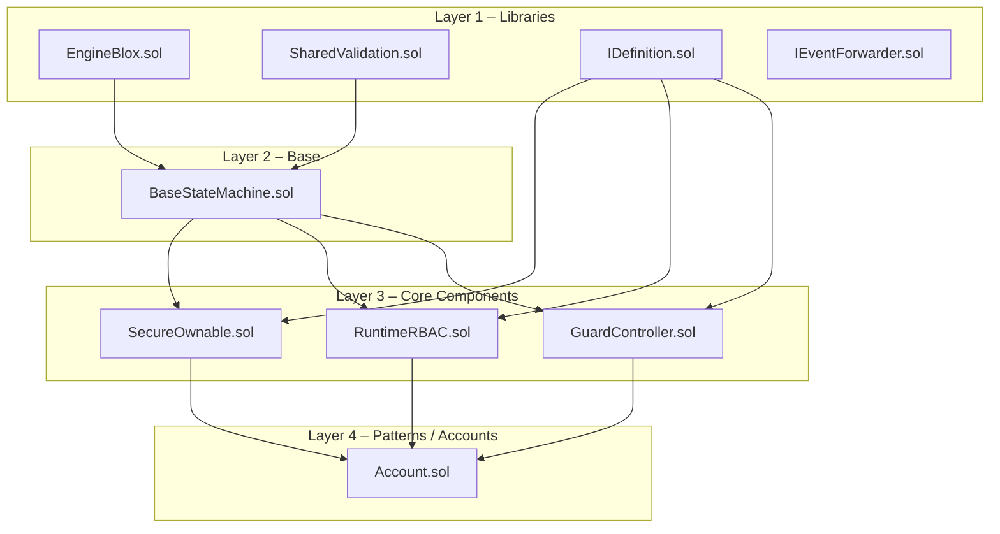
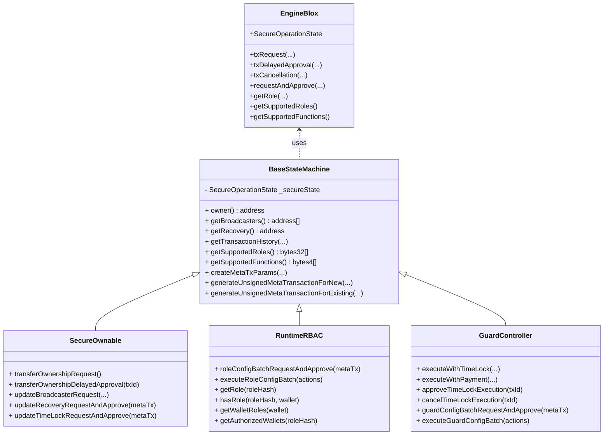
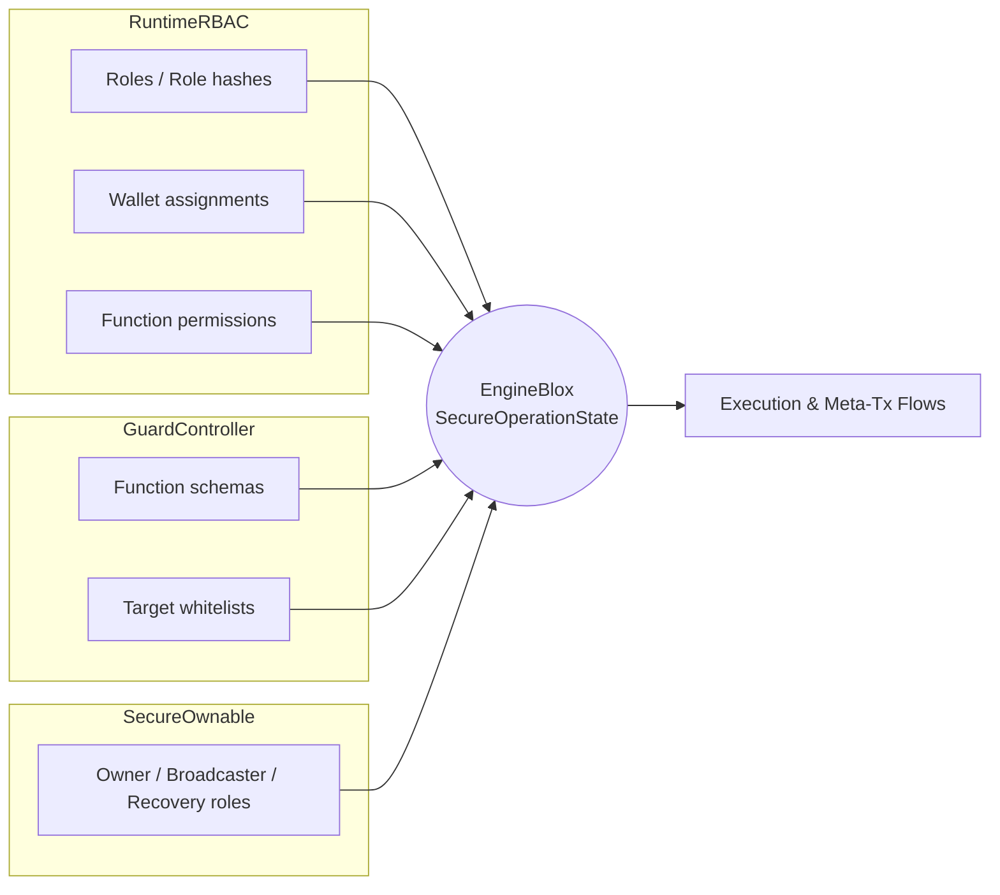
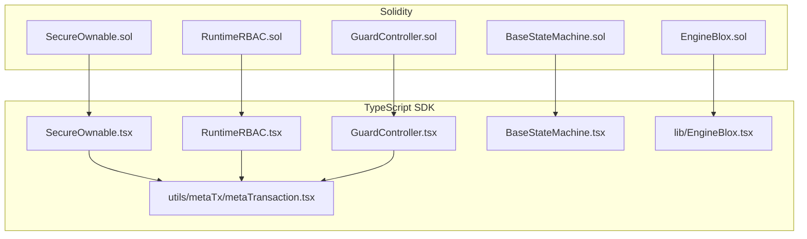

## Core Contract Graph – Bloxchain Protocol

This document shows how the **core Solidity contracts** under `contracts/core` relate to each other and how the **TypeScript SDK** maps onto them.

The diagram is intentionally high‑level and focuses on:
- **Layers** (libraries → base → components → integrations)
- **Composition / inheritance**
- **Runtime relationships** (who calls what at runtime)

---

## 🔩 Layered Architecture

At a high level, the core contracts are organized into four layers:

- **Layer 1 – Libraries**
  - `EngineBlox.sol`: Implements the `SecureOperationState` state machine, transaction lifecycle, RBAC primitives, function schemas, meta‑tx helpers, and target whitelists.
  - `SharedValidation.sol`: Common validation helpers and custom errors, used across the core.
  - `IDefinition.sol`, `SecureOwnableDefinitions.sol`, `RuntimeRBACDefinitions.sol`, `GuardControllerDefinitions.sol`: Definition interfaces and libraries that describe standardized function schemas, operation types, and role permissions.
  - `IEventForwarder.sol`: Interface for forwarding component events off‑chain.

- **Layer 2 – Base**
  - `BaseStateMachine.sol`: Thin, upgrade‑safe wrapper around `EngineBlox.SecureOperationState`.
    - Owns the `_secureState` storage.
    - Exposes query APIs (roles, tx history, function schemas, pending txs).
    - Provides meta‑transaction helpers.
    - Enforces **CEI** and **non‑reentrancy** on approval/execution flows.

- **Layer 3 – Core Components**
  - `SecureOwnable.sol`: Ownership, broadcaster, and recovery management on top of the state machine.
  - `RuntimeRBAC.sol`: Dynamic role‑based access control and batch configuration flows.
  - `GuardController.sol`: Guarded execution (time‑lock + whitelists + meta‑tx) for arbitrary targets.

- **Layer 4 – Patterns / Accounts**
  - `Account.sol`: Compositional pattern that wires `SecureOwnable`, `RuntimeRBAC`, and `GuardController` together into a reusable account / wallet‑like building block.

---

## 🧠 State Machine & Components

All three core components share the same underlying `SecureOperationState` via `BaseStateMachine`:

**Key idea:** `EngineBlox` is the **state and rules engine**; `BaseStateMachine` is the **shared façade**; each component adds business logic and constraints for a specific concern.

---

## 🔐 Roles, Permissions, and Guarded Execution

### Role and permission flow

- `SecureOwnable`:
  - Owns **protected roles** (`OWNER_ROLE`, `BROADCASTER_ROLE`, `RECOVERY_ROLE`) and enforces the policy that only SecureOwnable can change their wallets.
- `RuntimeRBAC`:
  - Manages **non‑protected roles** and their function permissions.
  - Batch operations are executed via `roleConfigBatchRequestAndApprove` → `executeRoleConfigBatch`.
- `GuardController`:
  - Manages **function schemas** and **target whitelists**.
  - Execution always checks: function schema + RBAC permissions + whitelist + time‑lock / meta‑tx constraints.

---

## 🌉 TypeScript SDK Mapping

The TypeScript SDK provides thin, type‑safe wrappers that map almost 1:1 to the core contracts:

- `SecureOwnable.tsx`, `RuntimeRBAC.tsx`, `GuardController.tsx`
  - Wrap the respective Solidity contracts and expose read/write methods documented in `api-reference.md`, `secure-ownable.md`, `runtime-rbac.md`, and `guard-controller.md`.
- `BaseStateMachine.tsx`
  - Exposes common state queries (tx history, roles, function schemas) against any state‑machine‑based contract.
- `lib/EngineBlox.tsx`
  - Mirrors pure `EngineBlox` helpers (e.g. `NATIVE_TRANSFER_SELECTOR`, role hashes, bitmap helpers, signer recovery).
- `utils/metaTx/metaTransaction.tsx`
  - Helps build, sign, and submit meta‑transactions that match the exact EIP‑712 domain and struct hashes used by `EngineBlox`.

---

## 🔎 How to Read the Graphs When Working in Code

- **Adding or changing a core behavior**:
  - Start from the relevant component (`SecureOwnable`, `RuntimeRBAC`, `GuardController`).
  - Follow its calls into `BaseStateMachine` and then into `EngineBlox`.
  - Update the corresponding TS wrapper and docs under `sdk/typescript/docs`.

- **Understanding a runtime flow (e.g. role config batch, guarded call)**:
  - Trace from the **public entry point** (e.g. `roleConfigBatchRequestAndApprove`, `executeWithTimeLock`) into the state machine.
  - Check the **definition library** (`*Definitions.sol`) that defines the function schemas and permissions used by that flow.
  - Use the TS SDK wrappers and helpers (`RuntimeRBAC.tsx`, `GuardController.tsx`, `EngineBlox.tsx`, meta‑tx utils) to recreate the same flow off‑chain.

For deeper architectural detail, see:
- `bloxchain-architecture.md`
- `state-machine-engine.md`
- `definition-contract.md`

